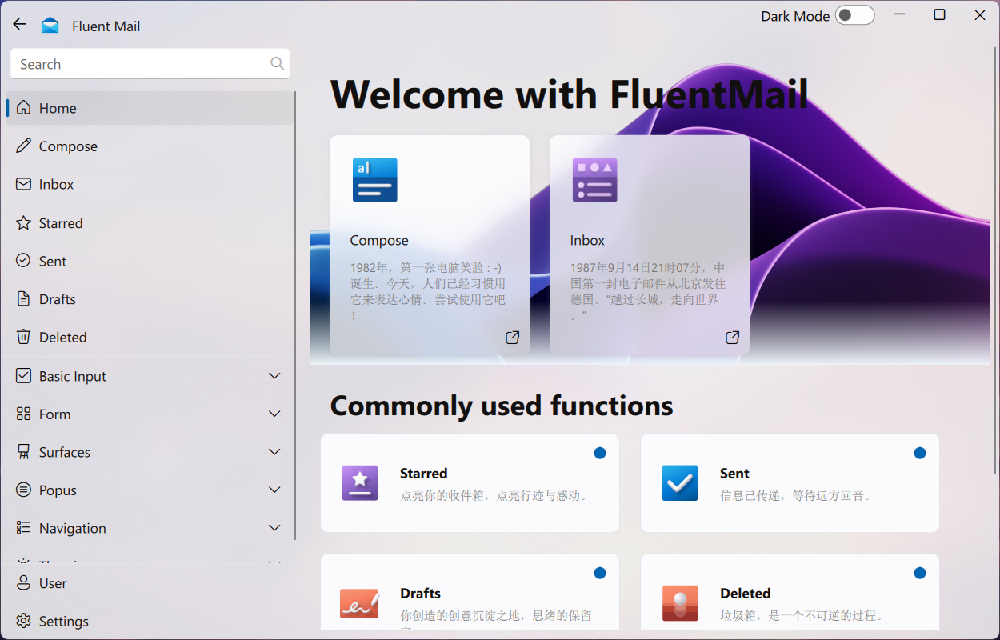
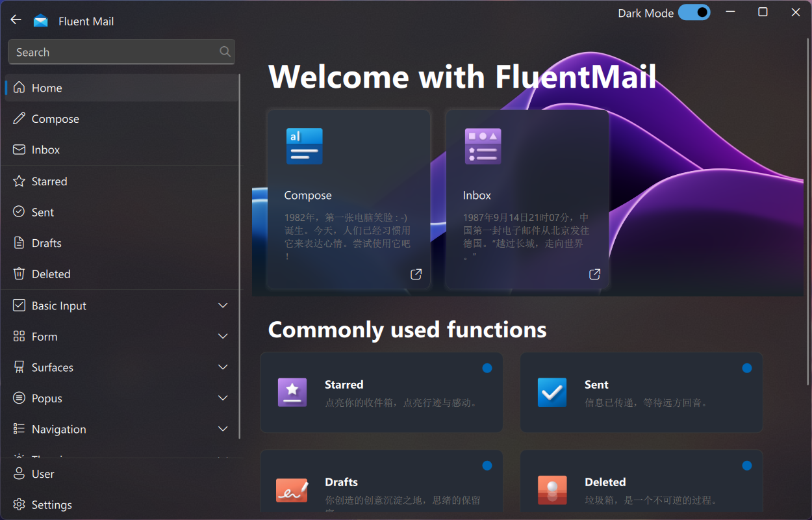
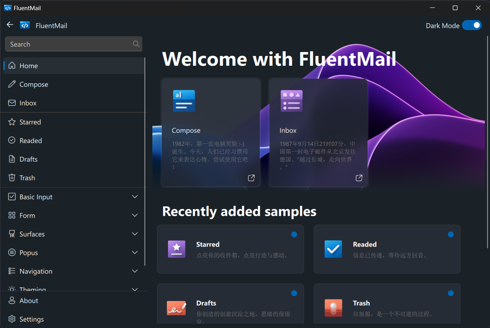

<div align=center>


# FluentMail

A program to send and recieve emails with attachments.

</div>




<details>
<summary>Something old...</summary>



</details>

## Local Development

Install Qt desktop application framework:

[Download Qt OSS: Get Qt Online Installer](https://www.qt.io/download-qt-installer-oss)

Making sure you've installed with Qt, MinGW/MSVC, CMake and Ninja from the Qt installer.

If you have some troubles about the version, please check and use the version below to ensure the code running correctly:

- Qt SDK: 6.5.1
  - Qt MinGW: 11.2.0
  - Qt 5 Compatibility module: 6.5.1
  - Qt Shader Tools: 6.5.1
- MinGW: 11.2.0
- CMake: 3.24.2
- Ninja: 1.11.1

Then try clone the repository:

```bash
git clone --recursive https://github.com/cworld1/fluent-mail.git
cd fluent-mail
```

## Run the code

```bash
mkdir build
cd build
cmake -DCMAKE_PREFIX_PATH=<YOUR_QT_SDK_DIR_PATH> -DCMAKE_BUILD_TYPE=Release -GNinja <PATH_TO_THE_REPOSITORY>
cmake --build . --config Release --target all --parallel
```

## UI Design Scheme

| Name                      | Value              |
| ------------------------- | ------------------ |
| Title                     | Fluent Mail        |
| Main color                | #0066B4            |
| Background light color    | #EEF4F9            |
| Background dark color     | #1A2228            |
| Background inactive color | #202020            |
| Border radius             | 8px                |
| Font                      | Microsoft YaHei UI |

## License

The GPL-3.0 License (GPL-3.0).
