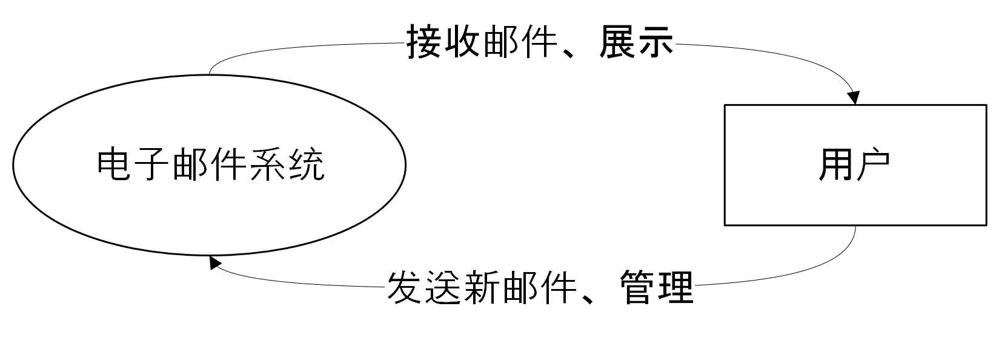
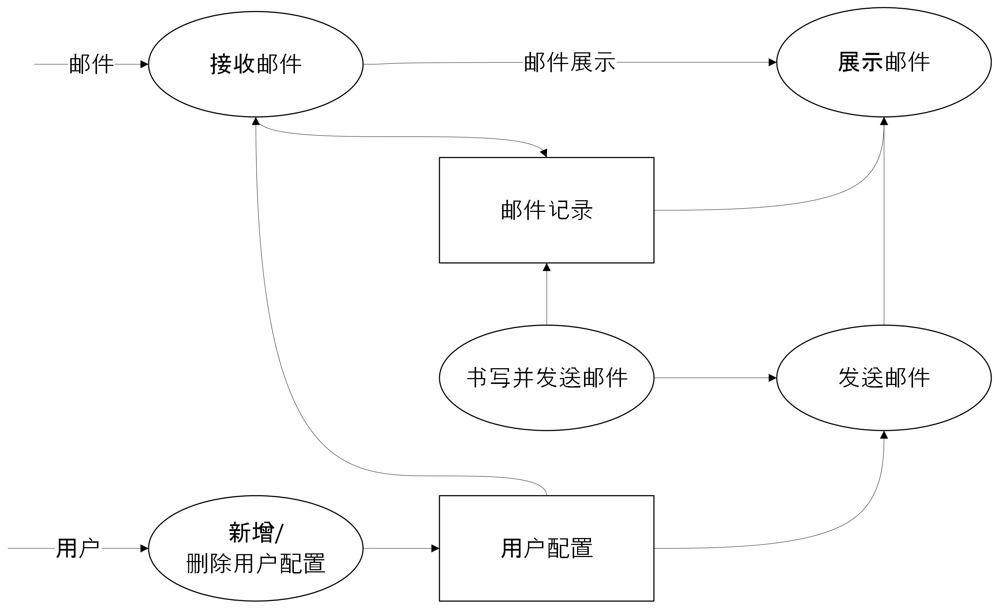
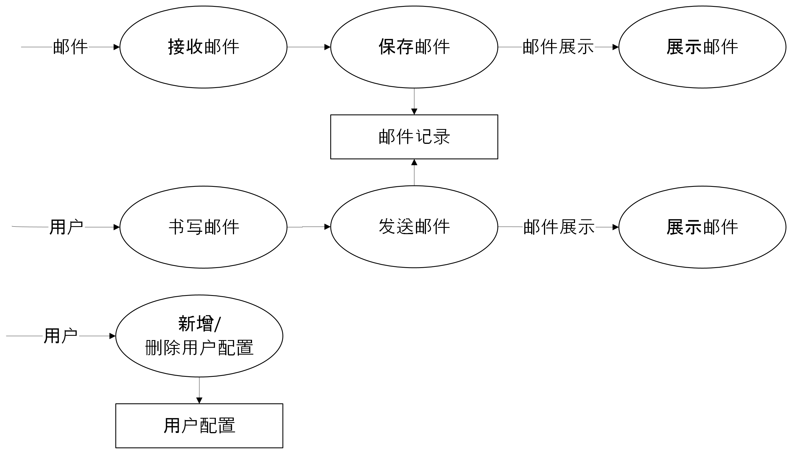

# 电子邮件系统开题报告

## 研究背景和意义

### 电子邮件的历史背景

电子邮件（E-mail）又称电子信箱、电子邮政，它是一种用现代网络技术提供信息交换的通信方式。它是因特网上使用最普遍的一项服务。这种非交互式的通信方式，加速了信息的交流及数据传送，它是一个简易、快速的方法。通过连接全世界的 Internet，实现各类信息的传送、接收、存贮等处理，将邮件送到世界的各个角落。电子邮件是 Internet 资源使用最多的一种服务，E-mail 不只局限于信件的传递，还可用来传递文件、声音及图片等不同类型的信息。

### 电子邮件的工作

电子邮件是一种荐储转发式的服务，这正是电子信箱素统的核心：利用荐储转发可以实现非实时通信，属异步通信方式。即邮件发送者可以随时随地发送邮件，不需要接收者同时在场。即使対方现在不在，仍可将邮件立刻送到对方的信箱内，且存储在对方的电子邮箱中。收信人可以在他认为方便的时候收取信件，不受时问、地点的限制。在这里，“发送”邮件意味着将邮件放到收件人的信箱中，而“接收”邮件则是收信人从自已的信箱中读取信件，信箱实际上是由文件管理系统支持的一个实体。

### 电子邮件系统的发展趋势

电子邮件系统经过若干年的发展，已经形成了较为完善的技术体系。邮件服务器系统在保留了最初的收发邮件、存储邮件等基本功能的同时，结合了最新的计算机与网络技术，使电子邮件系统得到了全新的改观。如今，电子邮件已经成为人们日常生活和工作中不可或缺的一部分。因此，设计和实现一个高效、安全、易用的电子邮件系统具有重要的研究意义和应用价值。

## 问题描述

对电子邮件系统进行添加账号、修改、查询、删除、发送、接收等管理。

基本要求：

1. 考虑到课程设计特点，数据管理以文件加工形式，不考虑数据库后台管理和多用户并发操作。
2. 提供基本的邮件扫描搜索功能。
3. 可能需要提供：邮件模板功能、常用联系人存储功能、批量发送或转发功能。

## 系统设计

### 用户身份与服务配置

在该系统中，用户可以通过配置 SMTP、IMAP。一旦用户配置成功后，他们可以访问收件箱和发件箱，以发送和接收电子邮件。

### 邮件传输

该系统使用 SMTP 协议来进行电子邮件传输。当用户发送电子邮件时，该系统将连接到 SMTP 服务器并使用合适的身份验证来发送邮件。

### 数据库设计

数据库是其中非常重要的一部分，因为它将保存所有用户、邮件和相关信息。为了存储和管理电子邮件信息，我们需要设计一个数据库来存储邮件主题、正文、发送者、收件人等内容。下面是电子邮件系统数据库设计的一些基本方面：

1. 认证表：该表将记录用户的 IMAP 和 SMTP 配置信息，SMTP 配置确保用户可以访问他们的帐户并执行必要的操作，如发送电子邮件或管理联系人列表。IMAP 配置则负责拉取、检索获得来自服务器的文件夹、邮件及邮件状态等信息。
2. 邮件表：该表将存储所有电子邮件的信息，如发送者、接收者、主题、内容、附件等。此外，还可以包括时间戳以及关于邮件状态（已读、未读等）的信息。
3. 文件表：当电子邮件带有附件时，文件表将存储附件的信息，如文件名、文件类型、文件大小等。
4. 联系人表：该表将存储每个用户的联系人列表。这个表可能包括联系人名称、电子邮件地址以及其他相关信息。
5. 日志表：该表将记录系统活动，如登录日志、发送邮件日志、修改用户信息等。这些信息将有助于监控系统性能、发现潜在问题以及进行故障排除。
6. 安全表：该表将记录系统安全设置，如防火墙规则、IP 地址限制、SSL 证书等。
7. 统计表：该表将记录每个用户的活动统计信息，如发送电子邮件数、接收电子邮件数、联系人数等。这些信息可以用于优化系统性能并提供更好的服务。

在数据库设计过程中，我们需要注意以下几点：

1. 规范化数据：尽可能规范化数据库，以避免数据冗余和一致性问题。
2. 定义关键字：对于每个表，定义适当的主键和外键。主键将帮助唯一标识每个记录，而外键将帮助建立不同表之间的关系。
3. 调整性能：进行必要的性能调整，以确保查询速度快且响应时间短。
4. 安全性：确保数据库具有足够的安全措施，以保护敏感信息并防止不良行为。

### 系统安全

为了确保系统的安全性，我们将使用 HTTPS 协议和 LTS 加密技术来保护用户数据和通信安全。此外，我们还可能需要提供用户对数据库的手动备份甚至导出导入功能，并定期清理无用数据，以提高系统的可用性。

## 数据结构图

### 功能模块结构图

### 三层数据流图

顶层图：

0 层图：

1 层图：

## 系统实现

在该项目中，我们将使用 C++和 Qt 库来实现电子邮件系统。具体实现过程中，我们将使用以下技术：

- SMTP 协议
- HTTPS 协议
- 数据库管理系统
- LTS 加密通讯技术
- Qt 框架

以上技术将协同工作，以创建一个功能完备、易用、可靠和高效的电子邮件系统。

## 预期结果

我们预计该项目可以实现以下目标：

- 创建一个高效、安全和易用的电子邮件系统。
- 提供用户身份认证、收件箱、发件箱、邮件传输等功能。
- 建立一个稳定、可靠的数据库，并对其进行备份和优化。
- 保护用户数据和通信安全，以提高系统的可用性和安全性。

## 研究方法

在该项目中，我们将采用如下步骤：

1. 设计系统架构和流程图。
2. 编写用户身份认证、邮件传输、数据库管理和加密等程序。
3. 实现开题报告编辑器和 PDF 输出程序。
4. 进行系统测试和优化，确保其性能和安全性。
5. 撰写课程设计报告并进行答辩。

## 研究计划

我们将按照以下时间表来完成该项目：

| 时间段      | 工作内容                 |
| ----------- | ------------------------ |
| 第 1-2 周   | 系统设计和技术选型       |
| 第 3-6 周   | 编写程序代码             |
| 第 7-8 周   | 实现邮箱客户端大部分功能 |
| 第 9-10 周  | 进行系统测试和优化       |
| 第 11-12 周 | 撰写课程设计报告         |

## 参考文献

参考文献列表：

- Qt 官方文档：https://doc.qt.io/qt-5/index.html
- Qt 的邮件库类：https://doc.qt.io/qt-5/qmailtools-module.html
- PyQt 邮箱客户端示例代码：https://github.com/ma-ji/pyqt-mail-client
- 一个基于 Qt 的邮件客户端的教程：http://www.bogotobogo.com/Qt/Qt5_QtQuick2_MailClient_Tutorial_Part1.php
- C++ 的 SMTP 库：https://github.com/cutelyst/cutelyst/tree/master/examples/smtp
- 一个使用 C++ 和 Qt 编写的邮件客户端项目：https://github.com/silveiralexf/qt-mail-client
