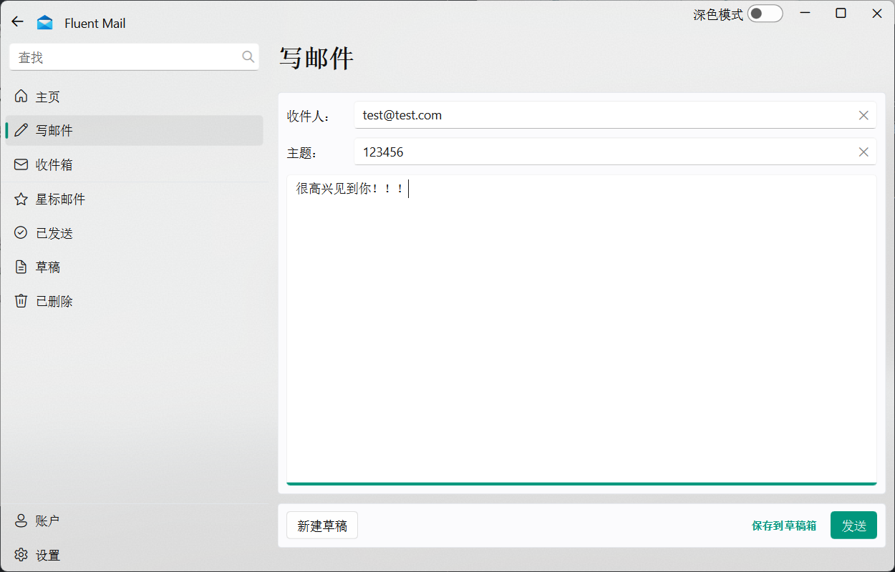

# 基于 Qt/C++ 的邮件综合管理客户端的设计与实现

【摘要】电子邮件（E-mail）是 Internet 上使用广泛的服务其中之一，传统的 Email 应用模式基于 C/S 结构，用户以使用客户端的邮件收发工具（如 Outlook、Foxmail 等）与提供邮件服务的服务器(如 163.net、263.net、371.net)进行通信，用户需要进行一些必要的设置在使用客户端邮件工具之前，例如，需要对邮件服务器的主机地址和通信端口等的指定，这些工作对刚开始上网的用户会有一定的困难，如果把 E-mail 和 Web 结合在一起，通过 Web 编程和适当的系统设置，那么用户仅仅以访问 Web 的方式就可以得到和使用完整的邮件服务，这样使用户上网更加方便，这种系统称为 Web Mail。Web Mail 是目前 Internet 上最受欢迎的服务之一，也是很多网站必备功能之一，另外 Web Mail 同样也适用于企业或校园网的应用。此邮箱系统功能主要分为账户管理和邮件管理两个部分，账户管理主要包括管理新增账户配置、查看和切换账户信息、删除账户等：邮件管理主要包括个人邮箱的管理、邮件收发等。该系统可以根据需求对功能进行扩展和完善。

[Abstract] Email is one of the widely used services on the Internet. The traditional email application model is based on a client-server structure, in which users communicate with email servers (such as 163.net, 263.net, 371.net) using email clients like Outlook and Foxmail. Before using the client email tool, users need to perform some necessary settings, such as specifying the host address and communication port of the email server. These tasks can be difficult for users who are new to the Internet. If email and web are combined through web programming and proper system settings, users can access and use the complete email service just by accessing it as they would a website. This makes it more convenient for users to go online, and this system is called Web Mail. Web Mail is currently one of the most popular services on the Internet and is an essential function for many websites. Additionally, Web Mail is also suitable for enterprise or campus network applications. This email system mainly consists of two parts: account management and email management. Account management includes managing new account configurations, viewing and switching account information, and deleting accounts. Email management includes managing personal mailboxes, sending and receiving emails, etc. The system can be extended and improved according to specific needs.

【关键词】电子邮件，邮件服务，客户端，Qt 编程，C++，QML，SQL，数据库，结构化设计

## 引言

随着互联网的发展和电子邮件的普及，电子邮箱成为人们日常生活和工作中不可或缺的一部分。为了满足用户对于更方便、更高效的电子邮件管理的需求，我们开展了一项数据结构课程设计，旨在设计和开发一个功能强大的在线交互式综合电子邮箱客户端。

本文就基于 C++/Qt 和 QML 的邮件管理系统的设计与实现进行研究。邮件管理系统是一个基于用户关系的邮件收发，邮件管理和用户管理系统。该系统利用 C++语言和 VSCode 编辑工具对系统进行编写。同时给出了详细的系统设计过程、部分界面图及主要功能运行流程图，邮件管理系统实现的功能有：邮件的接收、查看、删除、标记，草稿的新增、查看、删除、保存、发送，对账户信息的增加、删除、切换，用户可以对邮箱信息进行管理。适用于所有的邮箱使用者，为用提供了一个良好的邮件管理途径。

本系统采用 MVC 模式设计，实现了一个简单的邮件管理系统。MVC 模式极大地提高了系统的复用性、灵活性、适应性、开发效率和可维护性，充分发挥了 Qml 等 Qt 组件的特点。此邮件管理系统主要是实现邮件的简单发送和接收，它有很多的优势，例如并不要求发送者和接受者同时存在，任何人在任何地点都可以发送邮件，接收者可以随时接收邮件，它并不会受到时间和地点的限制。而且用户可以对收到的邮件进行阅读，保存，删除等操作，方便了用户对邮件信息进行的管理。此次设计实现了邮件管理系统的设计与开发，本系统实现邮件的基本功能有，实现账户登入模块：用户登录后才能进行邮件收发操作。实现邮件收发：用户可收取和发送邮件实现邮件的阅读，删除功能。实现草稿功能：对用户草稿进行新增、保存、删除、发送功能。

该邮箱管理系统同时也结合了 SMTP、POP3、SSL 等常用的协议方式，以确保邮件传输的安全性和可靠性。同时，我们还运用了 FluentUI、Frameless 等第三方框架和库，为用户提供更流畅、直观的用户界面和交互体验。

## 概述

### 课题背景

电子邮件是介于书信、电话和传真之间的电子信息传送方式。随着互联网的进一步发展，电子邮件已经成为人们联系沟通的重要途径。电子邮件系统已经发展成为了一个相当复杂而且功能更为丰富的系统，它可以传送文档、图像、声音、图片、图像等多媒体信息，甚至于数据库或帐目报告等更加专业化的文件都可以以电子邮件的形式在网上分发。随着信息技术的发展以及电子邮件系统功能的日益强大，它的应用领域已得到较大的提升。网络的普及使得邮件管理系统得以广泛的应用。采用开放的 Web 邮件服务不仅为用户省去了维护与升级客户端软件的麻烦，并且也能够充分发挥系统软硬件资源的作用。Web 邮件服务的另一个优势是允许用户，甚至是持有移动设备的用户，可以随时、随地的访问系统并进行信息传递。

电子邮件（E-mail）又称电子信箱、电子邮政，它是一种用现代网络技术提供信息交换的通信方式。它是因特网上使用最普遍的一项服务。这种非交互式的通信方式，加速了信息的交流及数据传送，它是一个简易、快速的方法。通过连接全世界的 Internet，实现各类信息的传送、接收、存贮等处理，将邮件送到世界的各个角落。电子邮件是 Internet 资源使用最多的一种服务，E-mail 不只局限于信件的传递，还可用来传递文件、声音及图片等不同类型的信息。

#### 电子邮件的工作

电子邮件是一种荐储转发式的服务，这正是电子信箱素统的核心：利用荐储转发可以实现非实时通信，属异步通信方式。即邮件发送者可以随时随地发送邮件，不需要接收者同时在场。即使対方现在不在，仍可将邮件立刻送到对方的信箱内，且存储在对方的电子邮箱中。收信人可以在他认为方便的时候收取信件，不受时问、地点的限制。在这里，“发送”邮件意味着将邮件放到收件人的信箱中，而“接收”邮件则是收信人从自已的信箱中读取信件，信箱实际上是由文件管理系统支持的一个实体。

#### 电子邮件系统的发展趋势

电子邮件系统经过若干年的发展，已经形成了较为完善的技术体系。邮件服务器系统在保留了最初的收发邮件、存储邮件等基本功能的同时，结合了最新的计算机与网络技术，使电子邮件系统得到了全新的改观。如今，电子邮件已经成为人们日常生活和工作中不可或缺的一部分。因此，设计和实现一个高效、安全、易用的电子邮件系统具有重要的研究意义和应用价值。

### 研究内容

随着新技术的不断涌现，电子邮件产品越来越多，而且也越来越丰富。在邮件服务器端有 FTPMail 服务器、Microsoft Exchange 服务器、Qmail 服务器等等。这些服务器都有相应的操作系统支持，而且有的又有很好的跨平台性，像 Send mail 服务器它在 Linux、Unix、都可用。在邮件系统客户端，其中 Microsoft Outlook、Netscape Mail、Fox mail 是当今电子邮件客户端软件的主流产品：另外，随着网络的普及，基于 Web 的应用模式的发展与应用，例如 sina、163 以及众多的企业都已推出了自己的 Web 邮件系统。本课题将研究如何使用 Qt、POP3、STMP、IMAP 等技术实现邮件查看处理。利用 Qt 等实现其功能，功能主要有邮件和账户的综合管理等等。

### 软件的开发方法

面向对象的方法经由系统分析、设计和试验等几个阶段，并需要遵从软件生命周期的规律。软件的生命周期指一个软件从它的开发到其消亡的过程）。以下就是利用生命周期法开发软件在各个阶段的具体内容：

1. 问题定义及其可行性论证：明确软件开发的请求，并进行初步的调查，通过可行性研究确定下一阶段的实施。可行性分析的任务就是确定项目开发的可行性和必要性。也就是说，对所提出的问题进行分析，来决定所提出的问题是否“可行”。可行性是指，首先要在技术上可行，现有技术能否解决所提出的问题：其次是在经济上可行，用户能否支付实施项目所需要的费用，项目建成后能否取得预期的经济效益：最后进行操作上和法律上的可行性研究。综合这些方面，最终决定是否实施该项目。

2. 用户需求分析阶段：在这个阶段中，就是了解用户的需求，准确的确定用户需要的功能，明确为了实现这些功能，需要做哪些处理，需要处理哪些数据：需要存储什么数据文件：得到什么信息。并且需要找出为了实现功能所需要的约束条件，例如，成本约束和时间约束。另一个重要任务是要规定系统的生效准则，规定在目标系统建成后验收目标系统的一些原则以及具体的验收方法等。具体工作主要是详细调查，其具体的调查内容有分析当前各大网站上的邮箱的功能和实现方法，了解使用者在使用过程中存在的问题以及希望使用到的功能。

3. 系统设计阶段：此阶段的任务是在系统分析的基础上，按照逻辑模型的要求，合理地进行系统的总体设计和具体的物理设计，为下一阶段的系统实施提供必要的技术资料。具体分为：详细设计阶段和概要设计阶段。

   - 详细设计阶段：在这个阶段中的任务是进行系统所需要的数据结构设计和数据库的物理设计。输入输出设计、编写程序模块设计说明书。
   - 概要设计阶段：这个阶段中的主要任务是得到一个能够实现用户需求的理想的系统结构。所谓理想的结构指的是：能够实现需求阶段中规定的功能；系统容易设计和实现；系统易于维护。设计内容包括划分子系统、设计规范制定、数据流程图设计、功能结构图设计、系统物理配置方案设计。

   系统设计工作结束后，要提交系统设计报告。若系统设计被审查批准，整个系统开发工作便进入系统实施阶段。

4. 系统实施阶段：这是软件系统的实现阶段，要进行模块编码和模块测试。模块测试又称为单元测试。模块编码要严格按详细设计阶段开发的模块逻辑进行。模块程序设计完成之后，应经过严格的测试。程序测试应该采用科学的方法。主要是黑盒法和白盒法进行测试，从而尽可能多地发现模块中错误，并加以改正。把经过彻底测试的模块组装起来形成需要的应用系统。再进行集成测试，采用的是黑盒测试方法，集成的方法可采用自顶向下集成或自底向上集成，或者二者结合的方法。

5. 维护阶段：主要包括改正性维护、适应性维护和完善性维护：改正性维护指的是修改程序中所遗漏的错误，确保用户程序能正常运行：完善性维护指的是增加了程序的功能，来满足用户的进一步需求：适应性维护指的是在用户改变硬件或软件支持环境时候，满足程序的需求来修改工作。维护阶段是一个非常重要的阶段，维护工作的好坏直接影响到用户的满意程度。

## 课程研究简述

在该项目中，我们将采用如下步骤：

1. 设计系统架构和流程图。
2. 编写用户身份认证、邮件信息传输、数据库管理和加密等程序。
3. 实现开题报告和简要示例程序。
4. 进行系统测试和优化，确保其性能和安全性。
5. 撰写课程设计报告并进行答辩。

### 研究计划

我们将按照以下时间表来完成该项目：

| 时间段      | 工作内容                 |
| ----------- | ------------------------ |
| 第 1-2 周   | 系统设计和技术选型       |
| 第 3-6 周   | 编写程序代码             |
| 第 7-8 周   | 实现邮箱客户端大部分功能 |
| 第 9-10 周  | 进行系统测试和优化       |
| 第 11-12 周 | 撰写课程设计报告         |

## 需求分析

### 功能规划的主体

凡事预则立，不预则废。科学的规划对于任何需要经过较长时间努力才能实现的事情都是非常重要的。

规划，一般是指对较长时期的活动进行总体的、全面的计划。做好计划是非常重要的环节。比如说邮件的开发系统，它是一个功能很多的系统，我就必须做好规划。主要在进入邮箱后功能方面规划，有收邮件、发邮件、写邮件、回邮件、草稿箱、垃圾箱和转发：在登陆邮箱界面上还有登录、登录账户列表、和退出邮箱等几个功能。还有其它一些基本的小功能都实现在各个主要功能的内部，比如说对于邮件箱内的邮件的删除等一些功能，这些都必须在开发前做好规划。总之，软件开发中，往往缺乏科学的、有效的系统规划。一定要尽量避免这些缺点。

### 关键技术

随着互联网的普及，国内外的互联网用户数呈指数增长。为满足不断增长的信息交流需要，作为因特网第一应用的电子邮件系统变得越来越重要。随着网络环境的建设与完善，许多用户已经提出这样的要求：拥有自己的邮件系统客户端。国外的电子邮件系统可真叫四通八达，这种手段已经成为他们通信最流行的几种方式之一了。相比较国内，电子邮件系统还不算太完善，电子邮件通信的方式还不算太流行，如何才能把这种方式大众化、流行化呢？这还需要我们去认识它、了解它、使用它。

国外已经有了许许多多的电子邮件系统，国内也有一些这样的系统，我觉得这些还不够充实这个庞大的流行团体，所以我自己要开发一个简单的属于我自己的电子邮件系统，来满足我及其他用户的需要。

### 性能需求分析

本邮件管理系统软件是一款安装在个人电脑上的客户端应用程序，因此需要满足用户界面简洁、友好、易于使用和操作的要求。该邮件管理系统的基本功能包括邮件的发送和接收以及账户管理等方面，其中账户管理需要实现实时响应。在邮件发送方面，系统需要快速响应，普通邮件需在 3 秒内完成发送，带有附件的邮件则需在 1 分钟内完成发送。系统响应速度对用户体验至关重要，若每个操作都需要长时间等待，则该软件系统注定无法成功。

邮件接收同样需要具备较高速度，对于普通邮件，系统应在 5 秒钟内完成接收，而对于带附件的邮件，系统应在 1 分钟内完成接收。

此外，系统运行时不应占用过多资源。如果一款软件占用了过多系统资源，会导致用户难以进行其他操作，这将直接影响用户的使用体验。因此，该软件还应具备低系统资源占用率的特点。

### 问题描述

对电子邮件系统进行添加账号、修改、查询、删除、发送、接收等管理。

基本要求：

1. 考虑到课程设计特点，数据管理以文件加工形式，不考虑数据库后台管理和多用户并发操作。
2. 提供基本的邮件扫描搜索功能。
3. 可能需要提供：邮件模板功能、常用联系人存储功能、批量发送或转发功能。

### 功能需求分析

#### 邮件管理系统用户需求分析

实际结合邮件管理系统的现实情况来说，主要有如下一些需求：

1. 邮件帐户管理，新建邮件帐户，删除邮件帐户。
2. 新建邮件，选择一个邮件帐户，输入收件人地址，发送邮件。
3. 接收邮件，选择一个邮件帐户，接收该邮件帐户上的邮件。
4. 邮件夹分类查看，包括发件箱，收件箱。

根据以上的分析，本系统主要实现：邮件账户管理、邮件发送、邮件接收、收件箱、发件箱管理等功能。希望通过该系统的建设能够基本实现一个简单且功能较为完备的邮件收发客户端系统。

#### 系统功能需求分析概述

根据用户需求，该邮件管理系统主要应包括如下功能：

1. **邮件帐户设置**

   邮件管理系统客户端软件需要支持多帐户邮件收发，类似 Outlook、Express、FoxMail 等邮件客户端软件。本系统能够支持新建邮件帐户、删除邮件账户等功能；

2. **邮件发送**

   发送邮件是一个邮件客户端软件的最基本功能，要求可以输入收件人的地址、邮件标题、邮件正文内容。

3. **邮件接收**

   要求能够接收系统中所有帐户的邮件，具体是先选择一个帐户，然后将该账户下的邮件接收到收件箱中。接收到的是一个邮件列表，主要包括邮件发件人、邮件标题、发送时间等信息。

4. **邮件夹管理**

   要求能够将用户收到的邮件放入收件箱中以列表的形式进行显示，对用户发送的邮件同样在发件箱中以列表形式进行显示。

5. **其他功能**

   主要包括邮件管理系统界面要美观，操作简便等。

### 预期结果

我们预计该项目可以实现以下目标：

- 创建一个高效、安全和易用的电子邮件客户端。
- 提供用户身份认证、收件箱、发件箱、邮件信息传输等功能。
- 建立一个稳定、可靠的数据库，并对其相关操作进行优化。
- 保护用户数据和通信安全，以提高系统的可用性和安全性。

## 系统分析

### 系统的可行性分析

可行性研究是以相对短的时间和相对低的成本来确定给定的问题是否有解。这里相对短和相对低是指和实现建议系统所需时间和成本相比较而言。可行性研究主要从下述 4 个方面进行研究：技术可行性、经济可行性、操作可行性和调度可行性。

1. 技术可行性：技术可行性的考虑集中在现存的计算机硬件能否支持被研究的系统，首先关心的是该组织是否有相应的软件和硬件能够支持处理建议的应用程序。其次考虑在规定平台之上，利用现有的成熟技术是否能够实现这个应用。现代计算机硬、软件技术的飞速发展，为系统建设提供了技术条件。计算机等基础设施的更新换代也紧跟潮流的发展，这就为开发系统提供了坚实基础。
2. 经济可行性：这是经典的并且是最常使用的评价计算机系统的方法。这个评价的结果称为成本/效益分析。简单地说，经济可行性研究是确定得自新系统的节省和利益，将这些利益和系统的实现成本相比较，如果利益超过成本，则开发新系统的决策是肯定的：否则的话，除非有其他特殊原因，这个决策将是否定的。本软件的实现是作为考核学生学习情况的手段，不存在经济可行性的问题。
3. 操作可行性：是指人员的手工操作而不是指计算机系统操作是否可行，也就是说在实现了建议的计算机系统后，所需要的配合的手工操作是否可行。作为新时代的学生，几乎人人都具备计算机的基本操作能力，而本软件的使用又十分简单方便，所以具备操作可行性。
4. 调度可行性：指的是建议的计算机系统能否在规定的期限内交付给用户。基于本软件，经过上述的分析，可以在规定的期限内完成。

从当前情况来看，本软件的开发是可行的。

### 系统逻辑方案的提出

在问题定义阶段对建议的功能、规模和约束条件等已经作了规定。在可行性研究阶段通过和使用者的交流，对用户的需求有了初步的了解。因此在这个阶段中，设计者应该进一步澄清问题定义中的模糊部分，更正错误部分。通过这个活动，清楚地描述系统的主要功能。

#### 用例图的分析

1. 用例的内容：

   用例图使我们对系统的功能有了一个整体的认知，我们可以知道有哪些参与者会与系统发生交互，每一个参与者需要系统为它提供什么样的服务。

2. 用例的优点：

   用例方法完全是站在用户的角度上（从系统的外部）来描述系统的功能的。在用例方法中，我们把被定义系统看作是一个黑箱，我们并不关心系统内部是如何完成它所提供的功能的。用例方法首先描述了被定义系统有哪些外部使用者（抽象成为 Actor），这些使用者与被定义系统发生交互：针对每一参与者，用例方法又描述了系统为这些参与者提供了什么样的服务（抽象成为 Use Case），或者说系统是如何被这些参与者使用的。所以从用例图中，我们可以得到对于被定义系统的一个总体印象。

   与传统的功能分解方式相比，用例方法完全是从外部来定义系统的功能，它把需求与设计完全分离开来。在面向对象的分析设计方法中，用例模型主要用于表述系统的功能性需求，系统的设计主要由对象模型来记录表述。另外，用例定义了系统功能的使用环境与上下文，每一个用例描述的是一个完整的系统服务。

3. 确定本系统功能的用户用例图，如图 4.1。

   

   新账户登陆本系统：

   - 登录账户：直接输入用户名和密码登陆系统。
   - 登陆成功：进入邮箱，其中具有收发邮件、写邮件、别除邮件等功。
   - 操作系统完成：可以退出本系统。

#### 用户功能

1. 用户登录：系统注册用户使用自己邮箱相关配置信息登录系统，进行邮件的管理和个人注册信息的管理。其中邮件的管理又包括收件箱、垃圾箱、草稿箱、发件箱、通信薄等的管理。
2. 撰写发送邮件：填写收件人、标题和收件内容后，可以给发件人发送邮件。
3. 收件箱管理：显示用户所有收到的邮件列表，可以查看邮件的详细内容，可以选中所要删除的邮件进行删除或者删除收件箱中所有邮件，所别除的邮件被转移到垃圾箱。
4. 垃圾箱管理：显示用户从收件箱中删除的所有邮件列表，可以查看邮件的详细内容，可以选中所要删除的邮件进行删除或者删除垃圾箱中所有邮件，所删除的邮件则被彻底地删除。
5. 草稿箱管理：显示用户所有保存的准备发送的邮件列表，可以查看邮件的详细内容并且进行修改，可以选中所要删除的邮件进行别除或者删除草稿箱中所有邮件。
6. 发件箱管理：显示用户发送的所有邮件列表，可以查看邮件的详细内容，可以选中所要删除的邮件进行删除或者删除所有已发邮件。

## 开发工具及运行环境

### 开发环境

硬件环境：

- CPU：AMD Ryzen 5 5600H with Radeon Graphics 3.30 GHz
- Installed RAM：16.0 GB (13.9 GB usable)
- 具备 Internet 上网条件。

软件环境：

- 操作系统：Windows 11 Pro 22H2 (Ver. 22621.1702)
- 系统支持：TCP/IP、万维网网络环境
- 环境支持工具：
  - **MySQL** (Ver. 8.0.11 for Win64 on x86_64 (MySQL Community Server - GPL))
  - **SQLite** (Ver. 3.42.0)
  - **C++** (Ver. 11.2.0 x86_64-posix-seh-rev3, Built by MinGW-W64 project Copyright (C) 2021 Free Software Foundation, Inc.)
- 开发工具：
  - **Visual Studio Code** (Ver. 1.78.2 b3e4e68a0bc097f0ae7907b217c1119af9e03435 x64)
  - **Qt Creator** (Ver. [d2b3c31e04](https://code.qt.io/cgit/qt-creator/qt-creator.git/log/?id=d2b3c31e0494ce03edf633adea50ca488456d09f) Based on Qt 6.4.3 (MSVC 2019, x86_64))
- 版本管理工具：Git (Ver. 2.37.1.windows.1)
- CI/CD & DevOps 持续交付和持续部署：Github Actions

> #### 简介 Qt Creator
>
> Qt Creator 是一款跨平台的集成开发环境（IDE），专门用于开发使用 Qt 框架的应用程序。Qt Creator 提供了一个现代化的用户界面，可以轻松创建、编辑、调试和部署 Qt 应用程序。它支持多种编程语言，包括 C++、QML 和 JavaScript，并提供了许多有用的功能，如代码补全、调试器、版本控制集成等。
>
> #### 简介 MySQL
>
> MySQL 数据库，它的缺点是，缺乏一个全功能数据库的大多数主要特征，但是它又有比类似 Xbase 记录存储引擎更多的特征。它像企业级 RDBMS 那样需要一个积极的服务者守护程序，但是不能象他们那样消费资源。其中 MySQL 数据库的查询语言允许复杂的连接(join)查询，但它要求所有的参考完整必须有强制保证。
>
> MySQL 在 Linux 世界里找到一个位置一提供简洁和速度，同时仍然提供足够的功能。它具备的查询功能和广泛的客户库被数据程序员广泛运用，数据库管理员会觉得系统缺乏主要数据库功能，他们会发觉它对简单数据库是有价值的。
>
> #### 简介 SQLite
>
> SQLite 是一种轻量级的关系型数据库管理系统，它不需要一个单独的服务器进程并且可以在大多数操作系统上运行。SQLite 以其简单性、可移植性和高效性而著称，被广泛用于嵌入式系统和移动设备应用程序中。SQLite 支持标准的 SQL 查询语言，并提供了许多有用的特性，如事务处理、索引、触发器等。由于 SQLite 不需要一个单独的服务器进程，因此它非常适合于需要在应用程序内部存储和管理数据的场景。

### 运行环境

系统环境的搭建，最基础的就是从目录的建立开始，建立系统的基础应用模块和对应配置环境，并进行数据库的正常连接。

#### 目录结构

在程序设计和开发之前要设计系统的目录结构，一般这个结构对任何得 C++程序系统都是通用的，本系统的目录结构如图 6-1 所示。


此目录结构中，FluentMail 代表本项目的根目录：

- .cache、bin、build 用于存放相关调试和程序生成文件。
- src、fluentmail、framelesshelper 分别用于存放 FluentUI 库文件、项目核心文件、Frameless 库文件。
- doc、doc-before 存放项目的文档相关文件。
- settings.ini 存放用户数据库配置信息。

而项目 fluentmail 中包括：

- qml 用于存放 UI 界面相关的文件。qml 中还包含：component、global、page 等文件夹，分别存放不同的设计文件。
- res 用于存放项目相关的图片资源。
- src 用于存放核心功能实现代码。

#### 通用模块

该系统采用数据库连接池对数据库进行的统一管理，同时在数据库操作上进行了封装，使得程序开发始于数据库的交互更加方便。

##### 数据库连接池

在实现某一个功能时，首先要连接数据库。如果在每一次需要进行数据库操作前都来加载驱动、创建连接，那么在连接的入口参数处理上便不好管理以及维护。一旦系统移植，数据库参数改变，将需要重新修改所有的连接代码，重新编译。

首先在文件 settings.ini 配置数据库连接参数，这些参数包括数据库的驱动、连接通信、用户名、密码。这样，在数据库移植或系统环境改变时，只需修改这一个地方就可以了，十分方便：

```ini
[database]
; > Database type: QSQLITE, QMYSQL
type = QSQLITE

; == For SQLite ==
; > Database file location
location = db
; > Database file name
filename = fluentmail.db

; == For MySQL ==
; > Database host
host = localhost
; > Database port
port = 3306
; > Database user
username = root
; > Database password
password = 123456
; > Database name
dbname = fluentmail
```

此系统采用了类 appInfo.user 来统一管理数据库的连接。具体代码参见 User.h 和 User.cpp 文件。

##### 数据库封装

数据库已经连接，在每一次需要进行数据库的某种操作时，调用 QSqlDatabase 的函数就可以了，但是直接调用 QSqlDatabase 函数将使代码的编写工作十分浪费，该系统封装了数据库操作的类 User，具体代码参见 User.h 和 User.cpp

该类封装了数据库操作的基本函数，用于作为 QObject 的派生类，便于统一管理。该类的一个重要作用是从连接池里取得一个连接，在使用结束时关闭连接。统一处理了很多额外的工作和异常的抛出。

### 主要开发模式和工具介绍

#### C++

1982 年，Bjarne Stroustrup 博士在 C 语言的基础上引入并扩充了面向对象的概念，发明了一种新的程序语言。为了表达该语言与 C 语言的渊源关系，命名为 C++。因此：C++基础知识入门是基于 C 语言而产生的，它既可以进行 C 语言的过程化程序设计，又可以进行以抽象数据类型为特点的基于对象的程序设计，还可以进行面向对象的程序设计。

自创建以来，C++ 即已成为世界上最常用的编程语言之一。 正确编写的 C++ 程序快速、高效。 相对于其他语言，该语言更加灵活：它可以在最高的抽象级别上运行，还可以在硅级低级别上运行。 C++ 提供高度优化的标准库。 它支持访问低级别硬件功能，从而最大限度地提高速度并最大程度地降低内存需求。 C++ 几乎可以创建任何类型的程序：游戏、设备驱动程序、HPC、云、桌面、嵌入式和移动应用等。 甚至用于其他编程语言的库和编译器也使用 C++ 编写。

C++ 的原始要求之一是与 C 语言向后兼容。 因此，C++ 始终允许 C 样式编程，其中包含原始指针、数组、以 null 结尾的字符串和其他功能。 它们可以实现良好的性能，但也可能会引发 bug 并增加复杂性。 C++ 的演变注重可显著降低 C 样式惯例使用需求的功能。 如果需要，你仍可以使用旧的 C 编程设施。 但是，在新式 C++ 代码中，对上述设施的需求会越来越少。 现代 C++ 代码更加简单、安全、美观，而且速度仍像以往一样快速。

#### 面向对象编程

虽然结构化编程的理念提高了程序的清晰度、可靠性、便于维护，但它在编写大型程序时，仍面临着挑战。为应付这种挑战，OOP 提供了新方法，与强调算法的过程性编程不同，OOP 强调的是数据。OOP 不像过程性编程那样，试图使问题满足语言的过程性方法，而是试图让语言来满足问题的要求。

面向对象程序设计（英语：Object-oriented programming，缩写：OOP）是种具有物件概念的编程典范，同时也是一种程序开发的抽象方针。它可能包含数据、特性、代码与方法。对象则指的是类（class）的实例。它将对象作为程序的基本单元，将程序和数据封装其中，以提高软件的重用性、灵活性和扩展性，物件里的程序可以访问及经常修改物件相关连的数据。在面向对象程序编程里，计算机程序会被设计成彼此相关的物件。

面向对象程序设计可以看作一种在程序中包含各种独立而又互相调用的对象的思想，这与传统的思想刚好相反：传统的程序设计主张将程序看作一系列函数的集合，或者直接就是一系列对电脑下达的指令。面向对象程序设计中的每一个对象都应该能够接受数据、处理数据并将数据传达给其它对象，因此它们都可以被看作一个小型的“机器”，即对象。目前已经被证实的是，面向对象程序设计推广了程序的灵活性和可维护性，并且在大型项目设计中广为应用。此外，支持者声称面向对象程序设计要比以往的做法更加便于学习，因为它能够让人们更简单地设计并维护程序，使得程序更加便于分析、设计、理解。反对者在某些领域对此予以否认。

当我们提到面向对象的时候，它不仅指一种程序设计方法。它更多意义上是一种程序开发方式。在这一方面，我们必须了解更多关于面向对象系统分析和面向对象设计（Object Oriented Design，简称 OOD）方面的知识。许多流行的编程语言是面向对象的，它们的风格就是会透由物件来创出实例。

重要的面向对象编程语言包含 Common Lisp、Python、C++、Objective-C、Smalltalk、Delphi、Java、Swift、C#、Perl、Ruby、JavaScript 与 PHP 等。

在 C++中，类是一种规范，它描述了这种新型数据格式，对象是根据这种规范构造的特定数据结构。通常，类规定了可使用哪些数据来表示对象以及可以对这些数据执行哪些操作。

OOP 程序设计方法首先设计类，它们准确表示了程序要处理的东西。

#### QML 介绍

QML（Qt Meta-Object Language）是一种声明性的用户界面描述语言，用于创建交互式应用程序界面。它是 Qt 框架中的一部分，旨在简化界面开发过程，使开发人员能够以声明性的方式定义用户界面的外观和行为。

QML 基于 JavaScript 语言，并通过一种类似于 CSS 的语法结构来描述用户界面元素的外观。它使用一种层次结构来组织界面元素，其中每个元素可以包含其他元素或属性。这种层次结构的组织方式使得 QML 界面的构建非常直观和灵活。

QML 的一些关键概念和特点：

1. **声明性语法**: QML 使用声明性语法，允许开发人员描述界面元素的属性、布局和行为，而无需编写大量的代码。通过简洁的语法，可以更容易地定义界面的外观和交互行为。

2. **组件化**: QML 支持将界面元素组织成可重用的组件。通过定义自定义的 QML 组件，可以将常用的界面元素封装起来，使得在应用程序中可以轻松地重复使用。这种组件化的方式提高了代码的可维护性和可扩展性。

3. **与 C++集成**: QML 与 Qt 框架的其他部分（如 C++）可以无缝集成。通过 Qt 的信号和槽机制，可以在 QML 界面中调用 C++代码，实现更复杂的业务逻辑和数据处理。

4. **动画和过渡效果**: QML 内置了丰富的动画和过渡效果支持。可以使用简单的动画属性和过渡定义来为界面元素添加动态效果，提升用户体验。

5. **样式和主题**: QML 允许通过样式和主题来自定义应用程序的外观。可以定义不同的样式和主题，以适应不同的设备和用户界面要求。

QML 广泛用于 Qt 应用程序的用户界面开发，特别是在移动和嵌入式领域。它提供了一种直观和高效的方式来构建现代、响应式和具有吸引力的用户界面。无论是开发桌面应用程序、移动应用程序还是嵌入式设备界面，QML 都提供了一种灵活且功能强大的工具来实现。

与传统 Qt/UI 方式相比，QML 的优点：

相比传统的 Qt/UI 方式，QML 具有以下几个主要的优点：

1. **声明性语法和简洁性**：QML 使用声明性语法，以更简洁和直观的方式描述用户界面。通过简单的属性设置和层次结构组织，可以快速定义界面元素的外观和行为，减少了编写冗长代码的工作量。
2. **可读性和可维护性**：由于 QML 的声明性语法，代码更易于阅读和理解。界面元素的属性和行为都以自然的方式进行描述，使得团队成员能够更轻松地理解和修改代码，从而提高了代码的可维护性。
3. **快速迭代和原型开发**：QML 提供了快速迭代和原型开发的环境。通过实时编辑和预览功能，开发人员可以即时查看界面的外观和交互效果，快速迭代和调整设计。这有助于加快开发速度和提高开发效率。
4. **动画和过渡效果**：QML 内置了强大的动画和过渡效果支持，可以轻松地为界面元素添加动态效果，提升用户体验。通过简单的属性设置，可以创建平滑的过渡、渐变效果和动画，使界面更具吸引力和交互性。
5. **与 C++集成**：QML 与 C++代码的集成非常方便。可以使用 Qt 的信号和槽机制，在 QML 中调用 C++代码，实现复杂的业务逻辑和数据处理。这种结合使用的方式使得开发人员可以充分发挥 C++的性能和功能，同时享受 QML 的声明性和灵活性。
6. **跨平台支持**：QML 可以在多个平台上运行，包括桌面、移动和嵌入式设备。这意味着可以使用相同的 QML 代码来构建应用程序的用户界面，而无需为不同的平台编写特定的界面逻辑。

QML 的优点主要在于它提供了一种简洁、声明性和灵活的方式来构建现代、响应式和具有吸引力的用户界面。它提供了更高的开发效率和可维护性，同时提供了丰富的动画和过渡效果，以及与 C++的无缝集成，使得开发人员能够更轻松地实现复杂的应用程序界面。

#### VC 模式设计思想

MVC 英文即 Model-View-Controller，即把一个应用的输入、处理、输出流程按照 Model、View、Controller 的方式进行分离，这样一个应用被分成三个层一模型层、视图层、控制层。视图 View)代表用户交互界面，对于 Qt/C++应用来说，可以概括为 QML 界面，但有可能为 JS、Qt 和 C++。随着应用的复杂性和规模性，界面的处理也变得具有挑战性。一个应用可能有很多不同的视图，MVC 设计模式对于视图的处理仅限于视图上数据的采集和处理，以及用户的请求，而不包括在视图上的业务流程的处理。业务流程的处理交予模型 Mode)处理。比如一个订单的视图只接受来自模型的数据并显示给用户，以及将用户界面的输入数据和请求传递给控制和模型。模型 Mod:就是业务流程/状态的处理以及业务规则的制定。业务流程的处理过程对其它层来说是黑箱操作，模型接受视图请求的数据，并返回最终的处理结果。业务模型的设计可以说是 MVC 最主要的核心。目前流行的 Qt/QML 模型就是一个典型的应用例子，它从应用技术实现的角度对模型做了进一步的划分，以便充分利用现有的组件，但它不能作为应用设计模型的框架。它仅仅告诉你按这种模型设计就可以利用某些技术组件，从而减少了技术上的困难。对一个开发者来说，就可以专注于业务模型的设计。MVC 设计模式告诉我们，把应用的模型按一定的规则抽取出来，抽取的层次很重要，这也是判断开发人员是否优秀的设计依据。抽象与具体不能隔得太远，也不能太近。

MVC 并没有提供模型的设计方法，而只告诉你应该组织管理这些模型，以便于模型的重构和提高重用性。我们可以用对象编程来做比喻，MVC 定义了一个顶级类，告诉它的子类你只能做这些，但没法限制你能做这些。这点对编程的开发人员非常重要。业务模型还有一个很重要的模型那就是数据模型。数据模型主要指实体对象的数据保存（持续化）。比如将一张订单保存到数据库，从数据库获取订单。我们可以将这个模型单独列出，所有有关数据库的操作只限制在该模型中例。控制（Controller）可以理解为从用户接收请求，将模型与视图匹配在一起，共同完成用户的请求。划分控制层的作用也很明显，它清楚地告诉你，它就是一个分发器，选择什么样的模型，选择什么样的视图，可以完成什么样的用户请求。控制层并不做任何的数据处理。例如，用户点击一个连接，控制层接受请求后，并不处理业务信息，它只把用户的信息传递给模型，告诉模型做什么，选择符合要求的视图返回给用户。因此，一个模型可能对应多个视图，一个视图可能对应多个模型。

模型、视图与控制器的分离，使得一个模型可以具有多个显示视图。如果用户通过某个视图的控制器改变了模型的数据，所有其它依赖于这些数据的视图都应反映到这些变化。因此，无论何时发生了何种数据变化，控制器都会将变化通知所有的视图，导致显示的更新。这实际上是一种模型的变化-传播机制。模型、视图、控制器三者之间的关系和各自的主要功能，如图 6-2 所示：


#### SMTP/POP3 协议

##### SSL 协议

SSL（互联网安全协议）采用通信两方建立加密通道以保证数据传输的机密，主要分作三部分：数据加密、身份验证和信息完整性验证，用户在设置客户端时勾选 SSL，邮件传输将进行加密，可以保证邮件内容的安全性。

由于要开发的是邮件客户端程序，就不得不用到 SMTP 协议和 POP3 协议。接下来先简单介绍一下 SMTP 协议。

##### SMTP 协议

简单邮件传输协议（SMTP）的目标是可靠高效地传送邮件，它独立于传送子系统而且仅要求一条可以保证传送数据单元顺序的通道。SMTP 的一个重要特点是它能够在传送中接力传送邮件，传送服务提供了进程间通信环境（PCE），此环境可以包括一个网络，几个网络或一个网络的子网。理解到传送系统（或 IPCE）不是一对一的是很重要的。进程可能直接和其它进程通过已知的 IPCE 通信。邮件是一个应用程序或进程间通信。邮件可以通过连接在不同 IPCE 上的进程跨网络进行邮件传送。更特别的是，邮件可以通过不同网络上的主机接力式传送。

##### SMTP 模型

SMTP 设计基于以下通信模型针对用户的邮件请求，发送 SMTP 建立与接收 SMTP 之间建立一个双向传送通道。接收 SMTP 可以是最终接收者也可以是中间传送者。SMTP 命令由发送 SMTP 发出，由接收 SMTP 接收，而应答则反方面传送。

一旦传送通道建立，SMTP 发送者发送 MAIL 命令指明邮件发送者。如果 SMTP 接收者可以接收邮件则返回 OK 应答。SMTP 发送者再发出 RCPT 命令确认邮件是否接收到。如果 SMTP 接收者接收，则返回 OK 应答：如果不能接收到，则发出拒绝接收应答（但不中止整个邮件操作)，双方将如此重复多次。当接收者收到全部邮件后会接收到特别的序列，如果接收者成功处理了邮件，则返回 OK 应答。

SMTP 提供传送邮件的机制，如果接收方与发送方连接在同一个传送服务下时，邮件可以直接由发送方主机传送到接收方主机：或者，当两者不在同一个传送服务下时，通过中继 SMTP 服务器传送。为了能够对 SMTP 服务器提供中继能力，它必须拥有最终目的主机地址和邮箱名称。

MAIL 命令参数是回复路径，它指定邮件从何处来：而 RCPT 命令的参数是转发路径的，它指定邮件向何处去。向前路径是源路径，而回复路径是返回路径（它用于发生错误时返回邮件）。

当同一个消息要发往不同的接收者时，SMTP 遇到了向不同接收者发送同一份数据的复制品的问题，邮件命令和应答有一个比较奇怪的语法，应答也有一个数字代码。在下面，例子中可以看到哪些使用实际的命令和应答。完整的命令和应答在第四节。命令与应答对大小写不敏感，也就是说，命令和应答可以是大写，小写或两者的混合，但这一点对用户邮件名称却不一定是对的，因为有的主机对用户名大小写是敏感的。这样 SMTP 实现中就将用户邮箱名称保留成初始时的样子，主机名称对大小写不敏感。

命令与应答由 ASCII 字母表组成，当传送服务提供 8 位字节传送通道，每 7 位字符正确传送，而最高位被填充为 0。当指定一般的命令或应答格式后，参数会由一些类似于语言的字符串表示出来，如 `<string>` 或 `<reverse-path>`，这里尖括号表示这是一种类似于语言的变量。

##### POP3 协议

POP3 是较早的协议，最初设计为仅在一台计算机上使用。 与使用双向同步的新式协议不同，POP3 仅支持单向电子邮件同步，仅允许用户将电子邮件从服务器下载到客户端。 因此，POP3 帐户缺少大多数可在更新式服务中找到的基本功能，如：

- 在多台设备上将邮件标记为已读的能力，这意味着每当用户使用 POP 将电子邮件下载到其他设备上时，它将显示为新邮件，而不是表明已在另一台设备上阅读该邮件。
- 从多台设备发送项目的能力。 已发送的项目不能使用 POP 进行同步，只能将其保存在来源设备上。
- 电子邮件到达时，将电子邮件推送到设备的功能。 相反，设备必须设置为定期自动检查电子邮件服务器，以查看是否收到新邮件。
- 为使用此电子邮件帐户的所有设备在一台设备上创建特殊文件夹或设定设置。 通过使用 POP，用户必须在其所有设备上手动创建或分别设置。 这意味着如果用户在一台设备上整理电子邮件，则需要对使用该 POP 电子邮件帐户的其他所有设备重新进行整理。

## 系统设计

### 系统流程

系统流程图又叫事务流程图，是在计算机事务处理应用进行系统分析时常用的一种描述方法（另一个是数据流图），它描述了计算机事务处理中从数据输入开始到获得输出为止，各个处理工序的逻辑过程。

用户的系统流程图：没有身份的用户需要先注册，登录系统后可以查看和修改个人信息、发送邮件等邮件管理操作。如下图 5-2 所示。


### 系统模块

通过系统模块的功能图描述，可以很直观的看到系统的各个功能组件，功能图如下图 5-3 所示。此模块的功能图是从整个系统出发，描绘出来的。其中介绍了管理员各个功能和基本用户的功能等等。用模块的功能图描绘整个系统，使系统各个功能清晰可见，层次分明，是一种比较好的方法。如图 7-1 所示。


### 数据库结构

在邮件服务器系统的数据库设计中，首先要创建系统数据库，然后在数据库中创建需要的表和字段。

数据库设计是系统设计中非常重要的一个环节，因为数据库设计就像在建设高楼大厦的根基一样，如果设计不好，在后来的系统维护、变更和功能扩充时，甚至于在系统开发过程中，都将会引起比较大的问题，有时大量的工作将会重新进行。

考虑到将来功能上的扩展，设计如下所示的数据项和数据结构：

- 用户信息：包括数据项，有用户名、密码、服务器配置等。
- 草稿信息：包括数据项，有发送人、主题、内容、最后修改时间、是否已发送等。
- 邮件信息：包括数据项，有发件人、收件人、主题、内容、发送时间等。
- 系统配置信息：包括数据项，有系统名称、系统说明、系统通信、数据库信息等。

基于上面的设计，在设计系统中的各表，表与表之间相互关联，系统所需要的数据被共同存储着。在设计数据库表的过程中，一般要遵循以下几个原则：

- 数据库设计的表最好只存储一个实体或对象的相关信息，不同的实体最好能够存储在不同的数据表中，如果实体还可以再划分，实体的划分原则是最好能够比当前系统要开发的实体的复杂度更小；
- 数据表的信息结构一定要合适，标的字段的数量一般不要过多；
- 扩充信息和动态变化的信息一定要分开在不同的表里；
- 多对多这样的表关系尽量不要出现等。

#### 实体之间的关系 E-R 图

在此邮件系统中的实体有管理员信息实体、用户信息实体、邮件实体、系统配置信息实体。

实体之间的关系 E-R 图如下图 7-2 所示。


#### 配置数据库

在创建表与视图之前，首先要创建一个数据服务，以 MySQL 为例，步骤如下：

1. 配置数据库，写入基本配置（MySQL 程序目录下的 my.ini 文件，如图 7-3 所示）：

   

   ```ini
   [mysqld]
   # 设置3306端口
   port=3306
   # 设置mysql的安装目录
   basedir=E:\\software\\mysql\\mysql-8.0.11-winx64
   # 切记此处一定要用双斜杠\\，单斜杠我这里会出错，不过看别人的教程，有的是单斜杠。自己尝试吧
   # 设置mysql数据库的数据的存放目录
   datadir=E:\\software\\mysql\\mysql-8.0.11-winx64\\Data # 此处同上
   # 允许最大连接数
   max_connections=200
   # 允许连接失败的次数。这是为了防止有人从该主机试图攻击数据库系统
   max_connect_errors=10
   # 服务端使用的字符集默认为UTF8
   character-set-server=utf8
   # 创建新表时将使用的默认存储引擎
   default-storage-engine=INNODB
   # 默认使用“mysql_native_password”插件认证
   default_authentication_plugin=mysql_native_password
   [mysql]
   # 设置mysql客户端默认字符集
   default-character-set=utf8
   [client]
   # 设置mysql客户端连接服务端时默认使用的端口
   port=3306
   default-character-set=utf8
   ```

2. 安装 MySQL 服务（在 MySQL 安装目录的 bin 目录下执行命令：）：

   ```bash
   mysqld --initialize --console
   mysqld --install mysql
   ```

   安装完成之后，通过命令启动 MySQL 的服务：

   ```bash
   net start mysql
   ```

3. 进入数据库终端验证：

   ```bash
   mysql -uroot -p
   ```

#### 配置系统运行信息

系统信息配置表如下，该表对系统的某些信息进行配置，如数据库引擎、数据库存放位置、数据库对接地址、用户名、密码、数据库名称等。进行这些设置是为了尽可能最大地利用有限的资源，同时更有效地管理系统，对使用该系统的数据库的信息也有一个很好的纪录。利用这个表，对系统的某些信息进行配置，使这些信息更加的清晰、使用也方便。

```ini
[database]
; > Database type: QSQLITE, QMYSQL
type = QSQLITE

; == For SQLite ==
; > Database file location
location = db
; > Database file name
filename = fluentmail.db

; == For MySQL ==
; > Database host
host = localhost
; > Database port
port = 3306
; > Database user
username = root
; > Database password
password = 123456
; > Database name
dbname = fluentmail
```

#### 当前用户表

表 7-1 是当前用户表，记录本系统的当前用户的相关信息。

- user_id 即当前用户 id。

| 名      | 类型 | 大小 | 比例 | 不是 null | 键  |
| ------- | ---- | ---- | ---- | --------- | --- |
| user_id | INT  |      |      | 是        |     |

#### 草稿表

表 7-2 是草稿表，记录本系统的邮件草稿信息。

- `id` 即“草稿编号”，是系统为其分配的唯一标识符；
- `email` 即接收方的邮箱地址；
- `subject` 即邮件草稿的主题；
- `content` 即邮件草稿的内容：
- `updated_at` 记录了用户更新草稿的时间；
- `is_sent` 记录了该草稿是否已经被发送。

| 名         | 类型      | 大小 | 比例 | 不是 null | 键   |
| ---------- | --------- | ---- | ---- | --------- | ---- |
| id         | INTEGER   |      |      | 是        | 主键 |
| email      | VARCHAR   | 255  |      | 是        |      |
| subject    | VARCHAR   | 255  |      | 是        |      |
| content    | TEXT      |      |      | 是        |      |
| updated_at | TIMESTAMP |      |      | 否        |      |
| is_sent    | TINYINT   |      |      | 否        |      |

#### 邮件信息记录表

表 7-3 是邮件信息记录表，记录系统用户所接收的所有邮件。其中：

- `id` 即“邮件编号”，是系统为其分配的唯一标识符；
- `message_id` 即邮件消息编号，是 pop3 协议为其分配的唯一标识符，用于避免重复接收邮件；
- `user_id` 即用户 id，用于区分具体某个账户接收的对应邮件；
- `email` 即发件人邮箱地址；
- `subject` 即邮件草稿的主题；
- `content` 即邮件草稿的内容：
- `received_at` 记录了邮件收到的时间；
- `is_readed` 即邮件是否被标记为已读；
- `is_starred` 即邮件是否被标记为星标邮件；
- `is_deleted` 即邮件是否被移除进垃圾箱。

| 名          | 类型      | 大小 | 比例 | 不是 null | 键  |
| ----------- | --------- | ---- | ---- | --------- | --- |
| id          | INTEGER   |      |      | 是        |     |
| message_id  | VARCHAR   | 255  |      | 是        |     |
| user_id     | INT       |      |      | 是        |     |
| email       | VARCHAR   | 255  |      | 是        |     |
| subject     | VARCHAR   | 255  |      | 是        |     |
| content     | TEXT      |      |      | 是        |     |
| received_at | TIMESTAMP |      |      | 否        |     |
| is_readed   | TINYINT   |      |      | 否        |     |
| is_starred  | TINYINT   |      |      | 否        |     |
| is_deleted  | TINYINT   |      |      | 否        |     |

#### 邮件发送表

表 7-4 是邮件发送表，记录了所有已经发送的邮件草稿，其中：

- `draft_id` 是邮件草稿的唯一标识 id；
- `user_id` 是发送该草稿的用户 id。

| 名       | 类型 | 大小 | 比例 | 不是 null | 键   |
| -------- | ---- | ---- | ---- | --------- | ---- |
| draft id | INT  |      |      | 否        | 主键 |
| user_id  | INT  |      |      | 是        |      |

#### 用户表

表 7-5 是用户表，该表包含了用户的基本且必要的信息，其中：

- `id` 是“用户编号”，是系统为用户分配的唯一标识符，它在整个用户表存储的数据里是互不相同的，而且在系统的许多其它表里也要用到它；
- 用户名和密码也是必需的；
- 与此同时 `smtp` 和 `pop3` 相关服务器地址也不能省略。

| 名         | 类型      | 大小 | 比例 | 不是 null | 键   |
| ---------- | --------- | ---- | ---- | --------- | ---- |
| id         | INTEGER   |      |      | 是        | 主键 |
| name       | VARCHAR   | 255  |      | 是        |      |
| email      | VARCHAR   | 255  |      | 是        |      |
| passwd     | VARCHAR   | 255  |      | 是        |      |
| smtp       | VARCHAR   | 255  |      | 是        |      |
| smtp_port  | INT       |      |      | 是        |      |
| pop3       | VARCHAR   | 255  |      | 是        |      |
| pop3_port  | INT       |      |      | 是        |      |
| created_at | TIMESTAMP |      |      | 否        |      |

至此，个个数据表的结构全部设计完成，即定义好邮件系统的数据结构，用于存储邮件系统中的各项数据。

## 界面设计与程序实现

有系统设计可知本系统的设计共分为如下两大部分：

1. 管理模块用于管理账户信息和系统设置，它包括：

   - 账户管理：账户新增、账户移除、账户切换。
   - 系统设置管理：修改程序

2. 邮箱模块用于用户进行邮件管理，它包括：

   - 撰写发送邮件：书写、保存、发送、创建空白邮件；
   - 收件箱管理：列表、查看、星标、已读、删除收件箱邮件；
   - 垃圾箱管理：列表、查看、删除、还原垃圾箱邮件；
   - 草稿箱管理：列表、查看、删除、还原草稿箱邮件；
   - 发件箱管理：列表、查看、删除、发件箱邮件。

根据这些整体关系的设计下面对每一个部分给出主界面的设计及其设计思路。

### 整体应用框架与首页展示的设计与实现

整体设计风格采用 Fluent Design，遵循 Windows 的最新设计规范，使用左右式导航栏设计，左侧用于用户导航，右侧用于用户实际操控。

整体使用类 Mica 的亚克力材质，并搭配有深色模式与浅色模式两种。用户启动后，允许通过关闭按钮将其最小化收纳至系统托盘，以便需要时快速启动邮箱、后台刷新、后台通知新邮件。

首页通过多栏分割，展示出错落有致的整体样式布局，大大提高了界面的美观程度，提高了应用现代化和趣味性。同时也通过多彩的图标和描述，激发了用户探索和使用的兴趣。

第一栏展示了一句欢迎语句和最常用写邮件和收邮件两个核心功能，占据了界面的一整个板块。同时还在旁边留出了一篇空白，不会显得拥挤，同时又能很好地方便后续新功能的加入。

第二栏展示了星标邮件、已发送邮件、草稿箱和垃圾箱，都是常用功能，于首页极大程度上方便了页面跳转，减少用户学习成本。


即使已经拥有主题切换等一系列功能，通体设计上还是以蓝色为主色调，

### 账户管理模块设计与实现

进入账户管理界面后，首要的功能是对多个账户的管理。账户管理主页面上具有进入新增账户的入口。该页面同时还展示了每个账户的名称、邮箱地址，以及对应的切换和删除功能。设计结果如图 6-2 所示。


当用户需要删除商户时，只需要在对应账户的板块上单击“删除”按钮，就可以删除该用户的对应配置信息。当需要将邮箱配置切换到指定账户时，只需要在对应账户的板块上单击“切换”按钮，即可即可将邮箱配置切换到指定账户。

用户查看账户列表的页面代码源文件为 `fluentmail\qml\page\T_User.qml`。这个页面对接的核心功能代码主要是执行表 users 的 SELECT 查询语句，查得的结果是多行记录，通过函数 `QList<QObject *> getUsers()` 循环取出所有的记录，保存在 UserObject 类的对应变量中。

### 设置模块和关于模块的设计与实现

系统设置管理主要包括界面主题配、文本渲染模式、深浅色主题、侧栏展示模式、语言切换、关于界面跳转等。界面上提供相应功能的 UI 展示，如果是选择的是关于，还要展示弹窗以及二级界面的详细窗口，界面设计如果图 6-4 所示。


系统设置管理页面代码的源文件为 `fluentmail\qml\page\T_Settings.qml`。后台的操作主要是对接前台的操作，对界面展示效果和配置文件进行更新。

关于界面的页面代码的源文件为 `fluentmail\qml\window\LoginWindow.qml`。

### 添加账户模块设计与实现

如图 6-5 所示即为添加账户界面的设计结果，左侧是一个展示设计理念与美观性的轮播图。当用户填写完所需要填写的信息之后，单击“登录”按钮，即可注册成功。而用户在添加完账户之后，会自动切换为该账户。


用户注册的页面主要是文件 `fluentmail\qml\window\LoginWindow.qml`。由用户注册的界面设计中可知，注册用户时主要是需要填写用户的基本信息，如用户名、密码、邮箱地址、服务器信息等，当用户单击“添加账户”按钮保存填入的数据时，页面需要将这些页面的表单取出来。在本页面的处理时，将页面的提交对象 request 作为参数，传进父程序界面 `User` 中，然后通过调用函数 `bool addUser(const QString &name, const QString &email, const QString &passwd, const QString &smtp, const int smtp_port, const QString &pop3, const int pop3_port)` 进行用户新增。在执行添加新用户之前，需要检验输入内容是否完整，一旦有一个输入内容为空，系统就会拒绝添加用户，因为众多内容缺一不可，然后再根据表 users 组合 INSERT 语句，执行数据库的新增操作。

此图为新用户注册失败后显示出来的提示，用于警示用户账户信息不完整。如图 6-6 所示。


### 用户撰写发送邮件模块设计与实现

用户登录后，主要的工作就是对邮件的管理，毕竟这是个简易邮件系统，因此系统默认进入到邮件管理的界面。而邮件管理又分为收件箱、草稿箱、发件箱、垃圾箱、发送邮件等功能，因此要为它们都设计侧栏菜单选项，单击各个选项，则进入各自的功能界面。为了界面的美观，可以寻找具有代表性的图标作为菜单开头提示。而当单击“写邮件”按钮进入邮件的撰写界面时，则要提供收件人、主题和内容的输入文本框，其中收件人和标题在文本框中输入，而内容则提供文本区域进行输入。界面设计的结果如图 6-9 所示。




在如图 6.9 所示的界面中点击“新建草稿”即可新建一篇草稿并清空所有输入内容。填写完所需要填写的信息之后，单击“发送”按钮，邮件则会被发送出去并将草稿移入已发送列表；单击“保存”按钮，邮件则被保存在草稿箱中。其中收件箱、发件箱、草稿箱、垃圾箱等按钮界面，在以后的界面设计中就省略掉了，不再赘述。

用户登录系统之后，就可以使用邮件管理的功能，首先是撰写邮件，然后是发送邮件。在用户撰写发送邮件的界面中可知，注册用户时需要填写邮件的基本信息，如收件人、标题和邮件内容等，在用户单击“发送”或者“保存”按钮保存填入的数据时，页面需要将这些页面的表单取出来。在本页面的处理时，将 QML 页面的提交对象作为参数，传进函数 `bool sendDraft(const QString &id)` 中，进行对邮件的新增操作。

以上发送邮件的代码所做的工作主要如下：

1. 检验所填数据或者信息的合法性，但按照国际通用邮箱规则，用户可以不书写主题或内容板块。
2. 根据是保存还是发送，对数据库进行操作。如果是保存，则把所编写的邮件保存在发件箱中；如果是发送，则可在已发邮件找到所发送的邮件。

### 用户收件箱管理模块设计与实现

当用户把邮件发送出去之后，收件人在收件箱中即可看到收到的所有邮件。和平时所用的邮箱的收件箱一样，此界面为所有邮件的列表信息，具体显示发件人、主题（邮件的标题）、日期和邮件内容等。如果要查看邮件的详细信息，则单击对应行的详细放大按钮即可。用户对收件箱进行清理，会删除所有不用的邮件，所以要提供“删除收件”按钮，在邮件列表的每一条邮件后面都提供有删除按钮，用来选择所要删除的邮件。用户收件箱管理界面设计如图 6-10 所示。


单击各个邮件的主题，即可查看邮件的详细内容，具体界面设计如图 6-11 所示。


草稿箱、发件箱、星标邮箱和垃圾箱要实现的功能，也都是先显示在一定状态下的所有邮件的列表中，功能实现过程与收件箱类似，这里不再一一重复介绍。用户在撰写邮件特别是撰写到一半时，可以先单击“保存”按钮保存到发件箱中等待以后处理，其实这里的发件箱功能类似于平时网络上所熟悉的电子邮箱中的草稿箱。在发件箱中可以查看没有发送的邮件。这个页面的源代码文件
为 `fluentmail\qml\page\T_MailList.qml`，实际上后面所要提到的已发信息收件箱和垃圾箱主页面等都是此 QML 文件，只不过根据所传递的参数 `title` 的值不同进行不同的处理。当然所用到的主要函数也是 `QList<QObject *> getMails(int page = 1, int page_size = 10, const QString &filter = "is_deleted = 0")`。在此类函数中，首先对邮件表根据发件箱字段的
条件进行组合并进行 SELECT 操作，把邮件信息存放到对象 MailObject 中，然后返回。在界面上只要循环取出 MailObject 组成的列表中的数据即可。

## 数据结构设计

### IPC

IPC（Inter-Process Communication，进程间通信）是指在不同进程之间进行数据交换和协调的机制。它可以让多个进程之间共享信息、资源和状态，从而实现更加复杂的应用程序。

常见的 IPC 机制包括管道、消息队列、共享内存和套接字等。这些机制提供了不同的方式来传递数据，比如有些机制是基于文件描述符的（如管道），有些则是基于命名对象的（如消息队列）。选择合适的 IPC 机制取决于具体的应用场景和需求。

```c++
class IPC : public QObject
{
    Q_OBJECT

protected:
    static const int EVENT_TIMER_MS = 1000;
    static const int EVENT_GC_TIMEOUT = 5;
    static const int EVENT_QUEUE_SIZE = 32; // 事件队列大小
    static const int OWNERSHIP_TIMEOUT_S = 5;

public:
    IPC(uint32_t profileId);
    ~IPC();

    struct IPCEvent
    {
        uint32_t dest;  // 目标
        int32_t sender; // 发送者
        char name[16];
        char data[128];
        time_t posted;    // 发布时间
        time_t processed; // 处理时间
        uint32_t flags;
        bool accepted;
        bool global;
    };

    struct IPCMemory
    {
        uint64_t globalId; // 全局ID
        time_t lastEvent;
        time_t laSMTProcessed;
        IPCEvent events[IPC::EVENT_QUEUE_SIZE]; // 事件队列
    };

    // 将一个事件发送给指定的进程
    time_t postEvent(const QString &name,                   // 事件名称
                     const QByteArray &data = QByteArray(), // 事件数据
                     uint32_t dest = 0);                    // 目标进程ID
    // 检查当前进程是否拥有 IPC 的所有权
    bool isCurrentOwner();
    // 注册事件处理函数
    void registerEventHandler(const QString &name, IPCEventHandler handler);
    bool isEventAccepted(time_t time);
    // 等待指定时间戳的事件被处理
    bool waitUntilAccepted(time_t time, int32_t timeout = -1);
    bool isAttached() const;

public slots:
    void setProfileId(uint32_t profileId);

private:
    // 获取全局 IPC 内存对象
    IPCMemory *global();
    bool runEventHandler(IPCEventHandler handler, const QByteArray &arg);
    IPCEvent *fetchEvent();
    // 处理事件队列中的所有事件
    void processEvents();
    bool isCurrentOwnerNoLock();

private:
    QTimer timer;
    uint64_t globalId;
    uint32_t profileId;         // 与该 IPC 实例相关联的进程 ID
    QSharedMemory globalMemory; // 全局内存
    QMap<QString, IPCEventHandler> eventHandlers;
};
```

### Lang

该类用于定义程序界面设计涉及的多语言，实现了动态加载程序文本内容，满足了多语言切换的需求，使程序更加灵活，资源管理更加集中化，有序化。

```c++
class Lang : public QObject
{
    Q_OBJECT

    // 常用关键词
    Q_PROPERTY_AUTO(QString, tip);
    // 操作
    Q_PROPERTY_AUTO(QString, cancel);
    Q_PROPERTY_AUTO(QString, cancel_info);
    Q_PROPERTY_AUTO(QString, confirm);
    // 显示 & 退出
    Q_PROPERTY_AUTO(QString, show);
    Q_PROPERTY_AUTO(QString, minimize);
    Q_PROPERTY_AUTO(QString, exit);
    // 删除
    Q_PROPERTY_AUTO(QString, delete_);
    Q_PROPERTY_AUTO(QString, delete_success);
    Q_PROPERTY_AUTO(QString, delete_failure);
    // 切换
    Q_PROPERTY_AUTO(QString, switch_);
    Q_PROPERTY_AUTO(QString, switch_success);
    Q_PROPERTY_AUTO(QString, switch_failure);

    // 侧栏
    Q_PROPERTY_AUTO(QString, search);

    Q_PROPERTY_AUTO(QString, home);
    Q_PROPERTY_AUTO(QString, compose);
    Q_PROPERTY_AUTO(QString, inbox);

    Q_PROPERTY_AUTO(QString, starred);
    Q_PROPERTY_AUTO(QString, sent);
    Q_PROPERTY_AUTO(QString, drafts);
    Q_PROPERTY_AUTO(QString, deleted);

    Q_PROPERTY_AUTO(QString, user);
    Q_PROPERTY_AUTO(QString, settings);

    // 首页
    Q_PROPERTY_AUTO(QString, welcome);
    Q_PROPERTY_AUTO(QString, common_use);
    Q_PROPERTY_AUTO(QString, recommend);

    // 写邮件
    Q_PROPERTY_AUTO(QString, to);
    Q_PROPERTY_AUTO(QString, to_placeholder);
    Q_PROPERTY_AUTO(QString, subject);
    Q_PROPERTY_AUTO(QString, subject_placeholder);
    Q_PROPERTY_AUTO(QString, content_placeholder);
    Q_PROPERTY_AUTO(QString, new_draft);
    Q_PROPERTY_AUTO(QString, save_to_drafts);
    Q_PROPERTY_AUTO(QString, send);
    Q_PROPERTY_AUTO(QString, send_success);

    // 账户管理
    Q_PROPERTY_AUTO(QString, manage_user);
    Q_PROPERTY_AUTO(QString, manage_user_add);
    Q_PROPERTY_AUTO(QString, manage_user_switch);
    Q_PROPERTY_AUTO(QString, manage_user_delete);

    // 新增账户
    Q_PROPERTY_AUTO(QString, user_name);
    Q_PROPERTY_AUTO(QString, user_name_placeholder);
    Q_PROPERTY_AUTO(QString, user_email);
    Q_PROPERTY_AUTO(QString, user_email_placeholder);
    Q_PROPERTY_AUTO(QString, user_password);
    Q_PROPERTY_AUTO(QString, user_password_placeholder);
    Q_PROPERTY_AUTO(QString, user_smtp);
    Q_PROPERTY_AUTO(QString, user_smtp_placeholder);
    Q_PROPERTY_AUTO(QString, user_pop3);
    Q_PROPERTY_AUTO(QString, user_pop3_placeholder);
    Q_PROPERTY_AUTO(QString, user_port_placeholder);
    Q_PROPERTY_AUTO(QString, user_add_confirm);

    // 关于
    Q_PROPERTY_AUTO(QString, about);

    // 邮件详情
    Q_PROPERTY_AUTO(QString, mail_detail);

    // 设置
    Q_PROPERTY_AUTO(QString, theme_color);
    Q_PROPERTY_AUTO(QString, theme_render_native);

    Q_PROPERTY_AUTO(QString, dark_mode);
    Q_PROPERTY_AUTO(QString, dark_mode_sys);
    Q_PROPERTY_AUTO(QString, dark_mode_light);
    Q_PROPERTY_AUTO(QString, dark_mode_dark);

    Q_PROPERTY_AUTO(QString, navigation_view);
    Q_PROPERTY_AUTO(QString, navigation_view_open);
    Q_PROPERTY_AUTO(QString, navigation_view_compact);
    Q_PROPERTY_AUTO(QString, navigation_view_minimal);
    Q_PROPERTY_AUTO(QString, navigation_view_auto);

    Q_PROPERTY_AUTO(QString, locale);

public:
    explicit Lang(QObject *parent = nullptr);
};
```

### En

该类基于 `Lang` 类派生，继续用于定义程序界面设计涉及的多语言，实现了动态加载程序文本内容。主要负责定义英文文本内容，并初始化所有父类的文本变量。

```c++
class En : public Lang
{
    Q_OBJECT
public:
    explicit En(QObject *parent = nullptr);

signals:
};
```

### Cn

该类基于 `Lang` 类派生，继续用于定义程序界面设计涉及的多语言，实现了动态加载程序文本内容。主要负责定义中文文本内容，并初始化所有父类的文本变量。

```c++
class Zh : public Lang
{
    Q_OBJECT
public:
    explicit Zh(QObject *parent = nullptr);

signals:

};
```

### User

该类用于定义用户相关信息处理，囊括了整个数据库的创建、查询、更新修改和删除。

```c++
class User : public QObject
{
    Q_OBJECT
public:
    // 初始化
    explicit User(QObject *parent = nullptr);
    Q_INVOKABLE bool createTables(QString dbType);

    // 账户相关
    Q_INVOKABLE QList<QObject *> getUsers();
    Q_INVOKABLE QString getCurUser();
    Q_INVOKABLE UserObject *getCurConfig();
    Q_INVOKABLE bool setUser(const QString id);
    Q_INVOKABLE bool delUser(const QString id);
    Q_INVOKABLE bool addUser(const QString &name, const QString &email, const QString &passwd,
                             const QString &smtp, const int smtp_port,
                             const QString &pop3, const int pop3_port);

    // 草稿相关
    Q_INVOKABLE QList<QObject *> getDrafts(int page = 1, int page_size = 10, const QString &filter = "is_sent = 0");
    Q_INVOKABLE DraftObject *getLatestDraft(bool is_new = false);
    Q_INVOKABLE bool updateDraft(const QString &id);
    Q_INVOKABLE bool deleteDraft(const QString &id);
    Q_INVOKABLE bool saveDraft(const QString &id, const QString &email, const QString &subject, const QString &content);
    Q_INVOKABLE bool sendDraft(const QString &id);

    // 邮件相关
    Q_INVOKABLE QList<QObject *> getMails(int page = 1, int page_size = 10, const QString &filter = "is_deleted = 0");
    Q_INVOKABLE void updateMail(const QString &id, const QString &field);
    Q_INVOKABLE bool addMail(MailObject *mail);

private:
    QSqlDatabase db;
    QSqlQuery query;
};
```

### UserObject

该类用于存放账户配置信息，集成了账户列表、获取、和修改监听，主要用在函数传递、界面交互与数据载入。

```c++
class UserObject : public QObject
{
    Q_OBJECT
    Q_PROPERTY(QString id READ id NOTIFY changed)
    Q_PROPERTY(QString name READ name NOTIFY changed)
    Q_PROPERTY(QString email READ email NOTIFY changed)
    Q_PROPERTY(QString passwd READ passwd NOTIFY changed)
    Q_PROPERTY(QString smtp READ smtp NOTIFY changed)
    Q_PROPERTY(int smtp_port READ smtp_port NOTIFY changed)
    Q_PROPERTY(QString pop3 READ pop3 NOTIFY changed)
    Q_PROPERTY(int pop3_port READ pop3_port NOTIFY changed)
    Q_PROPERTY(bool isCurUser READ isCurUser WRITE isCurUser NOTIFY changed)

public:
    UserObject()
    {
    }
    UserObject(const QString &id, const QString &name, const QString &email, const bool &isCurUser = false)
        : m_id(id), m_name(name), m_email(email), m_isCurUser(isCurUser)
    {
    }
    UserObject(const QString &id, const QString &name, const QString &email, const QString &passwd,
               const QString &smtp, const int smtp_port,
               const QString &pop3, const int pop3_port, const bool &isCurUser = false)
        : m_id(id), m_name(name), m_email(email), m_passwd(passwd), m_smtp(smtp), m_smtp_port(smtp_port),
          m_pop3(pop3), m_pop3_port(pop3_port), m_isCurUser(isCurUser)
    {
    }
    QString id() const { return m_id; }
    QString name() const { return m_name; }
    QString email() const { return m_email; }
    QString passwd() const { return m_passwd; }
    QString smtp() const { return m_smtp; }
    int smtp_port() const { return m_smtp_port; }
    QString pop3() const { return m_pop3; }
    int pop3_port() const { return m_pop3_port; }
    bool isCurUser() const { return m_isCurUser; }
    void isCurUser(bool isCurUser) { m_isCurUser = isCurUser; }

signals:
    void changed();

private:
    QString m_id;
    QString m_name;
    QString m_email;
    QString m_passwd;
    QString m_smtp;
    int m_smtp_port;
    QString m_pop3;
    int m_pop3_port;
    bool m_isCurUser;
};
```

### DraftObject

该类用于存放用户的草稿信息，集成了草稿列表、获取、和修改监听，主要用在函数传递、界面交互与数据载入。

```c++
class DraftObject : public QObject
{
    Q_OBJECT
    Q_PROPERTY(QString id READ id NOTIFY changed)
    Q_PROPERTY(QString email READ email NOTIFY changed)
    Q_PROPERTY(QString subject READ subject NOTIFY changed)
    Q_PROPERTY(QString content READ content NOTIFY changed)
    Q_PROPERTY(QString updated_at READ updated_at NOTIFY changed)

public:
    DraftObject(const QString &id, const QString &email, QString &subject, QString &content, QString &updated_at)
        : m_id(id), m_email(email), m_subject(subject), m_content(content), m_updated_at(updated_at)
    {
    }

    QString id() const { return m_id; }
    QString email() const { return m_email; }
    QString subject() const { return m_subject; }
    QString content() const { return m_content; }
    QString updated_at() const { return m_updated_at.left(10); }

signals:
    void changed();

private:
    QString m_id;
    QString m_email;
    QString m_subject;
    QString m_content;
    QString m_updated_at;
};
```

### MailObject

该类用于存放邮件信息，集成了邮件列表、获取、和修改监听，主要用在函数传递、界面交互与数据载入。

```c++
class MailObject : public QObject
{
    Q_OBJECT
    Q_PROPERTY(QString id READ id NOTIFY changed)
    Q_PROPERTY(QString email READ email NOTIFY changed)
    Q_PROPERTY(QString subject READ subject NOTIFY changed)
    Q_PROPERTY(QString content READ content NOTIFY changed)
    Q_PROPERTY(QString received_at READ received_at NOTIFY changed)
    Q_PROPERTY(bool is_readed READ is_readed NOTIFY changed)
    Q_PROPERTY(bool is_starred READ is_starred NOTIFY changed)
    Q_PROPERTY(bool is_deleted READ is_deleted NOTIFY changed)

public:
    MailObject(const QString &id, const QString &email, QString &subject, QString &content, QString &received_at,
               const bool &is_readed, const bool &is_starred, const bool &is_deleted)
        : m_id(id), m_email(email), m_subject(subject), m_content(content), m_received_at(received_at),
          m_is_readed(is_readed), m_is_starred(is_starred), m_is_deleted(is_deleted)
    {
    }

    QString id() const { return m_id; }
    QString email() const { return m_email; }
    QString subject() const { return m_subject; }
    QString content() const { return m_content; }
    QString received_at() const { return m_received_at.left(10); }
    bool is_readed() const { return m_is_readed; }
    bool is_starred() const { return m_is_starred; }
    bool is_deleted() const { return m_is_deleted; }

signals:
    void changed();

private:
    QString m_id;
    QString m_email;
    QString m_subject;
    QString m_content;
    QString m_received_at;
    bool m_is_readed;
    bool m_is_starred;
    bool m_is_deleted;
};
```

### Server

该类用于定义邮件与网络相关信息处理，实现了 IP/TCP、HTTP/SSL 以及 SMTP/POP3 协议和功能实现，囊括了系统与网络相关所有功能的交互。

```c++
class Server : public QObject
{
    Q_OBJECT
public:
    Server(UserObject *user);
    ~Server();
    Q_INVOKABLE void update(UserObject *user);
    Q_INVOKABLE bool smtp(const QString to, const QString subject, const QString body);
    Q_INVOKABLE bool pop3Init();
    Q_INVOKABLE int pop3Number();
    Q_INVOKABLE MailObject *pop3Get(int id);
    Q_INVOKABLE bool pop3Quit();

private:
    QSslSocket smtpSocket;
    QSslSocket pop3Socket;
    UserObject *user;
};
```

## 函数接口说明

### IPC

- `IPC::IPC(uint32_t profileId)`

  进程间通信

- `IPC::~IPC()`

  IPC 析构函数。在摧毁时自动调用。

- `time_t IPC::postEvent(const QString &name, const QByteArray &data, uint32_t dest)`

  发布 IPC 事件。

  **参数:**
  `name` – 要在 IPC 事件中设置的名称。
  `data` – 要在 IPC 事件中设置的数据（default QByteArray()）。
  `dest` – Settings::getCurrentProfileId() or 0 (main instance, default)。

  **返回:**
  事件完成的时间 or 错误 0。

- `bool IPC::isCurrentOwner()`

  检查当前进程是否是 IPC 共享内存的所有者。

  **返回:**
  如果当前进程是所有者，则返回 true，否则返回 false。

- `void IPC::registerEventHandler(const QString &name, IPCEventHandler handler)`

  注册 IPC 事件的处理程序

  **参数:**
  `handler` – 处理程序回调。最坏情况下不应阻塞超过一秒钟

- `bool IPC::waitUntilAccepted(time_t postTime, int32_t timeout /*=-1*/)`

- `bool IPC::isAttached() const`

- `IPC::IPCEvent *IPC::fetchEvent()`

  仅在**全局内存锁定**时调用。

  **返回:**
  如果不存在任何事件，则为空指针，否则为 IPC 事件

- `bool IPC::runEventHandler(IPCEventHandler handler, const QByteArray &arg)`

  运行事件处理程序

- `void IPC::processEvents()`

  处理事件

- `bool IPC::isCurrentOwnerNoLock()`

  仅在**全局内存锁定**时调用。

  **返回:**
  如果所有者 true，不是所有者或错误 false

### Lang

- `En::En(QObject *parent) : Lang{parent}`

  初始化英语

- `Zh::Zh(QObject *parent) : Lang{parent}`

  初始化中文

### AppInfo

- `AppInfo::AppInfo(QObject *parent) : QObject{parent}`

  AppInfo 类的构造函数。

  **参数:**
  `parent` – 父对象

- `void AppInfo::init(QQmlApplicationEngine *engine)`

  使用给定的 QQmlApplicationEngine 初始化 AppInfo 对象。

  **参数:**
  `engine` – 要初始化的 QQmlApplicationEngine。

- `void AppInfo::changeLang(const QString &locale)`

  更改应用程序的语言。

  **参数:**
  `locale` – 要更改为的语言环境。

  **备注:**
  更改语言时释放语言资源。

- `bool AppInfo::isOwnerProcess(IPC *ipc)`

  判断当前进程是否为 IPC 的所有者

  **参数:**
  `ipc` – 一个指向 IPC 对象的指针

  **返回:**
  如果当前进程是 IPC 的所有者，则返回 true，否则返回 false

  **备注:**
  释放资源后，需要重新初始化

### User

- `User::User(QObject *parent) : QObject{parent}`

  初始化数据库

- `bool User::createTables(QString dbType)`

  创建数据库表

  **返回:**
  bool 是否成功

- `QList<QObject *> User::getUsers()`

  获取所有账户信息（简短）

  **返回:**
  QList<QObject \*> 账户信息列表

- `QString User::getCurUser()`

  获取当前账户信息

  **返回:**
  QString 账户名

- `UserObject *User::getCurConfig()`

  获取当前账户配置

  **返回:**
  UserObject 账户配置

- `bool User::setUser(const QString id)`

  设置当前账户

  **参数:**
  `id` – 账户 id

- `bool User::delUser(const QString id)`

  删除账户

  **参数:**
  `id` – 账户 id

- `bool User::addUser(const QString &name, const QString &email, const QString &passwd, const QString &smtp, const int smtp_port, const QString &pop3, const int pop3_port)`

  添加账户

  **参数:**
  `name` – 账户名
  `email` – 邮箱
  `passwd` – 密码
  `smtp` – SMTP 服务器
  `smtp_port` – SMTP 端口
  `pop3` – POP3 服务器
  `pop3_port` – POP3 端口

- `QList<QObject *> User::getDrafts(int page, int page_size, const QString &filter)`

  获取草稿列表

  **返回:**
  QList<QObject \*> 草稿列表

- `DraftObject *User::getLatestDraft(bool is_new)`

  获取草稿

  **返回:**
  QString 草稿 id

  **备注:**
  如果没有草稿，则创建一个空草稿

- `bool User::updateDraft(const QString &id)`

  更新草稿

  **参数:**
  `id` – 草稿 id

  **返回:**
  bool 是否成功

- `bool User::deleteDraft(const QString &id)`

  删除草稿

  **参数:**
  `id` – 草稿 id

- `bool User::saveDraft(const QString &id, const QString &email, const QString &subject, const QString &content)`

  保存草稿

  **参数:**
  `id` – 草稿 id
  `email` – 邮箱
  `subject` – 主题
  `content` – 内容

  **返回:**
  bool 是否成功

- `bool User::sendDraft(const QString &id)`

  发送草稿

  **参数:**
  `id` – 草稿 id

  **返回:**
  bool 是否成功

- `QList<QObject *> User::getMails(int page, int page_size, const QString &filter)`

  获取邮件列表

  **参数:**
  `page` – 页码
  `page_size` – 每页数量
  `filter` – 过滤条件

- `void User::updateMail(const QString &id, const QString &field)`

  更新邮件

  **参数:**
  `id` – 邮件 id
  `field` – 字段

  **返回:**
  bool 是否成功

- `bool User::addMail(MailObject *mail)`

  添加邮件

  **参数:**
  `mail` – 邮件对象

  **返回:**
  bool 是否成功

### Server

- `Server::Server(UserObject *user)`

  构造函数，初始化类 Server

- `Server::~Server()`

  析构函数

- `bool Server::smtp(const QString toemail, const QString subject, const QString content)`

  发送邮件

  **参数:**
  `toemail` – 收件人邮箱
  `emailContent` – 邮件内容

  **返回:**
  true 发送成功 false 发送失败

- `bool Server::pop3Init()`

  初始化 POP3 连接

  **返回:**
  true 连接成功 false 连接失败

- `int Server::pop3Number()`

  获取邮件数量

  **返回:**
  int 邮件数量

- `MailObject *Server::pop3Get(int id)`

  获取指定 ID 的邮件

  **参数:**
  `id` – 邮件 ID

  **返回:**
  MailObject\* 邮件对象指针

- `bool Server::pop3Quit()`

  退出 POP3 连接

  **返回:**
  true 退出成功 false 退出失败

## 细节设计与分析

## 运行结果分析

### 账户管理

#### 新增账户

通过侧栏进入账户管理界面，点击右上角的新增账户。


输入信息妥当后，系统会提示新增成功，并将邮箱相关配置自动切换到此账户。如果有没有填写完整的配置，系统会报错并提示相关信息。


#### 切换账户

点击切换按钮，即可切换到对应的账户配置。每个账户的收件信息各自独立，并会成为发送时指定的发件人。

#### 删除账户

点击删除用户配置，会有弹窗提示是否删除。此次删除会删除用户配置信息和对应邮件，且不可逆。


### 邮件管理

从侧栏或首页点击收件箱即可进入对应视图。

#### 获取邮件

点击右下角的刷新按钮，即可获取对应邮件信息。由于缺乏合适的解析文本内容工具，可能会在正文部分出现一场字符，不会影响正常使用。


#### 查看邮件

点击针对想要查看的邮件，点击放大按钮查看。包含邮件信息和快速操作。


#### 标记邮件

点击已读、星标列即可实现标记为已读或星标，方便回溯邮件状态，帮助用户找到需要的邮件。


#### 删除邮件

点击删除按钮，即可将邮件移除到垃圾箱，用户仍可以前往垃圾箱查看。


### 发送邮件

发送邮件界面默认会展示最新的草稿记录。当当前数据库内无草稿时，系统会志雄创建一篇。

#### 新建并编辑草稿

点击新建草稿，即可快速新建一篇全新的草稿内容。如果用户不继续书写并保存任何内容就退出该页面前往其他页面，该草稿将被自动舍弃。


#### 保存并修改草稿

点击保存草稿，即可将当前草稿保存到草稿箱，并在书写邮件页面默认展示，切换至其他页面后重新切换回来也不会影响草稿所有内容。


草稿箱会忠实地记录当前数据库内的所有草稿，并按照修改时间顺序排序。


点击编辑按钮可重新编辑该邮件。

#### 发送草稿

点击发送按钮，即可将邮件发送至对方邮箱。指出需要注意，协议 SMTP 中，主题或邮件内容被允许为空，即使没有填写，同样不会被拒绝。


前往对方邮箱客户端，可以看到刚刚发送的信息。


#### 删除已发送记录

已发送列表详实地记录着用户的发送过的邮件记录。点击邮件旁的删除按钮即可移除该条记录。


### 其他功能测试

#### 切换数据库引擎

修改程序根目录下的 `settings.ini` 即可。默认为 SQLite，其拥有良好的兼容性和运行速度，无需服务支撑。

修改 `type` 为 `QMYSQL` 即可切换为 MySQL 引擎。相关配置按照对应的 SQL 服务修改即可。理论上还支持 `QSQLODBC` 等众多数据库。


#### 修改程序界面样式

点击程序侧栏的最后一项设置，前往程序的配置界面，包含修改程序配色、文本渲染模式、深浅色模式切换等。


程序默认根据用户窗口大小自动切换侧栏展示模式，此处也可以手动固定展示模式。

紧凑模式下，侧栏将收缩成一小列并只展示图标。


最小化模式下侧栏将以汉堡菜单的形式展示，不需要时可折叠收纳，类似于移动端的 Material Design 标准导航设计。


#### 更改程序语言

同样在程序设置板块，还设有程序语言切换功能。用户可跟根据需要切换对应的语言模式。该选项应用于绝大部分有文本展示的界面。


底部其他按钮用于测试 POP3 服务器，为开发者功能。关于界面将打开新窗口，介绍项目相关信息。


#### 启动、最小化与退出

启动会默认展示主页。


用户点击退出时，程序将提醒是否启用最小化托盘模式，在后台继续保持最低程度的运行。


收纳至托盘后，程序给出对应提示提醒用户。


托盘模式下，用户可以左键单击直接打开，也可以右键单击打开功能菜单。


## 总结

在熟悉了专门用于发送邮件的 SMTP 协议以及 RFC 规定的邮件的格式的基础上，运用了微软新推出的 C++这一面向对象语言的便利性和灵活性，从 SMTP 协议规定的底层命令做起，一步步的与服务器进行交互操作，最终实现发送多附件多接收人的功能。其中，具体的和服务器的交互操作，都封装了在 Server 这个类里面了。而为了方便最终的调用和整合，所有的有关后台操作发送邮件的类以及其他的附加功能的类，全部都归属于 User 这个类了。在力求达到 FoxMail 功能的同时，又加了一点个人的思想并把它体现到了这一软件上。

该系统在功能上比较完善，设计了邮件系统所有功能块，系统的关键部分主要集中在邮件管理部分上。该系统可以根据需求对功能进行扩展和完善。另外，此邮件系统可以作为某一系统的某一部分，可以把此系统作为组件形式，稍作修改添加到所要开发的系统中。本系统在开发过程中的最大特色如下：

1. 根据各个模块的功能需要，设计编写了功能完善的 QML 组件，使得整个系统界面和功能的设计思路非常清晰，而且易于维护和扩展。
2. 使用了多文件和类函数，方便管理，封装了数据库操作的类 `User`，使在编写 QML 组件时可以方便地调用数据库操作的函数。
3. 操作流程的清晰化，从账户管理、系统设置以及邮件的处理，通过使用的流程来贯穿整个系统的设计过程。
4. 邮件管理与用户管理的分开处理，同时又兼顾整个流程的连续性。

但是由于课程设计时间的关系，该系统还有许多不足之处，比如用户界面不够美观，程序比较烦琐，程序的鲁棒性、多种邮箱系统兼容性等多方面问题。这些都有待进一步改善。总之，当今网络技术日新月异、高速发展，为了适应这种变化，本系统还需要各个方面的努力来使它不断完善。

总之，通过这次的编程，使我对网络编程有了一个很好的认识和锻炼，也使我对 C++和 SQL 这些语言的掌握程度又上了一个新台阶，虽然编出来的软件不能和功能强大的 FoxMail 相提并论，但是相信它简单，易操作性，和 FoxMail 的很多强大但却“鸡肋”似的功能比较起来，更多了几分实用性。以后的日子，随着我技术的提高和思想的成熟，我一定会把它做的更好，更趋近于完美。

## 参考文献

1. Qt 官方文档. https://doc.qt.io/qt-5/index.html.
2. 张黎. C/S 模式下的电子邮件系统设计与实现[J]. 科技资讯, 2012, (02).
3. 王滨. 探讨电子邮件收发系统的设计研究及实现[J]. 计算机光盘软件与应用, 2011, (01).
4. 杜波依斯. MySQL 技术内幕(第 4 版)[M]. 人民邮电出版社, 2011.
5. Tim Parker. TCP/IP 协议及网络编程技术[M]. 北京: 机械工业出版社, 2000.
6. 滁州, 马金虎, 朱力勇. 编写基于 SMTP 网络应用程序[J]. 电脑爱好者, 2003, (05): 92-94.
7. 滁州, 马金虎, 朱力勇. 编写基于 P0P3 网络应用程序[J]. 电脑爱好者, 2003, (06): 92-94.
8. 中国协议分析网. http://www.cnpaf.net/.
9. Paul DuBois. MySQL[M]. Addison-Wesley Educational Publishers, Inc, USA, 2013.
10. Grady Booch, James Rumbaugh, Ivar Jacobson. The Unified Modeling Language User Guide (2nd Edition).

## 附录 源代码
