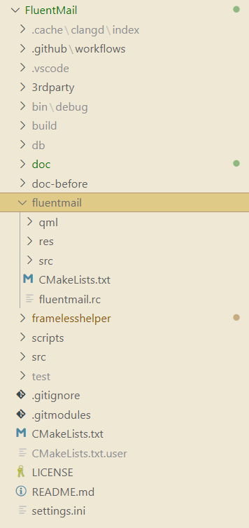
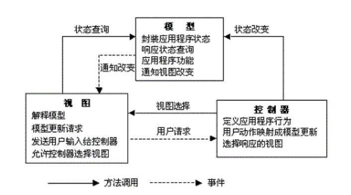

## 引言

随着互联网的发展和电子邮件的普及，电子邮箱成为人们日常生活和工作中不可或缺的一部分。为了满足用户对于更方便、更高效的电子邮件管理的需求，我们开展了一项数据结构课程设计，旨在设计和开发一个功能强大的在线交互式综合电子邮箱客户端。

本文就基于 C++/Qt 和 QML 的邮件管理系统的设计与实现进行研究。邮件管理系统是一个基于用户关系的邮件收发，邮件管理和用户管理系统。该系统利用 C++语言和 VSCode 编辑工具对系统进行编写。同时给出了详细的系统设计过程、部分界面图及主要功能运行流程图，邮件管理系统实现的功能有：邮件的接收、查看、删除、标记，草稿的新增、查看、删除、保存、发送，对账户信息的增加、删除、切换，用户可以对邮箱信息进行管理。适用于所有的邮箱使用者，为用提供了一个良好的邮件管理途径。

本系统采用 MVC 模式设计，实现了一个简单的邮件管理系统。MVC 模式极大地提高了系统的复用性、灵活性、适应性、开发效率和可维护性，充分发挥了 Qml 等 Qt 组件的特点。此邮件管理系统主要是实现邮件的简单发送和接收，它有很多的优势，例如并不要求发送者和接受者同时存在，任何人在任何地点都可以发送邮件，接收者可以随时接收邮件，它并不会受到时间和地点的限制。而且用户可以对收到的邮件进行阅读，保存，删除等操作，方便了用户对邮件信息进行的管理。此次设计实现了邮件管理系统的设计与开发，本系统实现邮件的基本功能有，实现账户登入模块：用户登录后才能进行邮件收发操作。实现邮件收发：用户可收取和发送邮件实现邮件的阅读，删除功能。实现草稿功能：对用户草稿进行新增、保存、删除、发送功能。

该邮箱管理系统同时也结合了 SMTP、POP3、SSL 等常用的协议方式，以确保邮件传输的安全性和可靠性。同时，我们还运用了 FluentUI、Frameless 等第三方框架和库，为用户提供更流畅、直观的用户界面和交互体验。

## 概述

### 课题背景

电子邮件是介于书信、电话和传真之间的电子信息传送方式。随着互联网的进一步发展，电子邮件已经成为人们联系沟通的重要途径。电子邮件系统已经发展成为了一个相当复杂而且功能更为丰富的系统，它可以传送文档、图像、声音、图片、图像等多媒体信息，甚至于数据库或帐目报告等更加专业化的文件都可以以电子邮件的形式在网上分发。随着信息技术的发展以及电子邮件系统功能的日益强大，它的应用领域已得到较大的提升。网络的普及使得邮件管理系统得以广泛的应用。采用开放的 Web 邮件服务不仅为用户省去了维护与升级客户端软件的麻烦，并且也能够充分发挥系统软硬件资源的作用。Web 邮件服务的另一个优势是允许用户，甚至是持有移动设备的用户，可以随时、随地的访问系统并进行信息传递。

### 研究内容

随着新技术的不断涌现，电子邮件产品越来越多，而且也越来越丰富。在邮件服务器端有 FTPMail 服务器、Microsoft Exchange 服务器、Qmail 服务器等等。这些服务器都有相应的操作系统支持，而且有的又有很好的跨平台性，像 Send mail 服务器它在 Linux、Unix、都可用。在邮件系统客户端，其中 Microsoft Outlook、Netscape Mail、Fox mail 是当今电子邮件客户端软件的主流产品：另外，随着网络的普及，基于 Web 的应用模式的发展与应用，例如 sina、163 以及众多的企业都已推出了自己的 Web 邮件系统。本课题将研究如何使用 Qt、POP3、STMP、IMAP 等技术实现邮件查看处理。利用 Qt 等实现其功能，功能主要有邮件和账户的综合管理等等。

### 软件的开发方法

面向对象的方法经由系统分析、设计和试验等几个阶段，并需要遵从软件生命周期的规律。软件的生命周期指一个软件从它的开发到其消亡的过程）。以下就是利用生命周期法开发软件在各个阶段的具体内容：

1. 问题定义及其可行性论证：明确软件开发的请求，并进行初步的调查，通过可行性研究确定下一阶段的实施。可行性分析的任务就是确定项目开发的可行性和必要性。也就是说，对所提出的问题进行分析，来决定所提出的问题是否“可行”。可行性是指，首先要在技术上可行，现有技术能否解决所提出的问题：其次是在经济上可行，用户能否支付实施项目所需要的费用，项目建成后能否取得预期的经济效益：最后进行操作上和法律上的可行性研究。综合这些方面，最终决定是否实施该项目。

2. 用户需求分析阶段：在这个阶段中，就是了解用户的需求，准确的确定用户需要的功能，明确为了实现这些功能，需要做哪些处理，需要处理哪些数据：需要存储什么数据文件：得到什么信息。并且需要找出为了实现功能所需要的约束条件，例如，成本约束和时间约束。另一个重要任务是要规定系统的生效准则，规定在目标系统建成后验收目标系统的一些原则以及具体的验收方法等。具体工作主要是详细调查，其具体的调查内容有分析当前各大网站上的邮箱的功能和实现方法，了解使用者在使用过程中存在的问题以及希望使用到的功能。

3. 系统设计阶段：此阶段的任务是在系统分析的基础上，按照逻辑模型的要求，合理地进行系统的总体设计和具体的物理设计，为下一阶段的系统实施提供必要的技术资料。具体分为：详细设计阶段和概要设计阶段。

   详细设计阶段：在这个阶段中的任务是进行系统所需要的数据结构设计和数据库的物理设计。输入输出设计、编写程序模块设计说明书。

   概要设计阶段：这个阶段中的主要任务是得到一个能够实现用户需求的理想的系统结构。所谓理想的结构指的是：能够实现需求阶段中规定的功能：系统容易设计和实现：系统易于维护。设计内容包括划分子系统、设计规范制定、数据流程图设计、功能结构图设计、系统物理配置方案设计。

   系统设计工作结束后，要提交系统设计报告。若系统设计被审查批准，整个系统开发工作便进入系统实施阶段。

4. 系统实施阶段：这是软件系统的实现阶段，要进行模块编码和模块测试。模块测试又称为单元测试。模块编码要严格按详细设计阶段开发的模块逻辑进行。模块程序设计完成之后，应经过严格的测试。程序测试应该采用科学的方法。主要是黑盒法和白盒法进行测试，从而尽可能多地发现模块中错误，并加以改正。把经过彻底测试的模块组装起来形成需要的应用系统。再进行集成测试，采用的是黑盒测试方法，集成的方法可采用自顶向下集成或自底向上集成，或者二者结合的方法。

5. 维护阶段：主要包括改正性维护、适应性维护和完善性维护：改正性维护指的是修改程序中所遗漏的错误，确保用户程序能正常运行：完善性维护指的是增加了程序的功能，来满足用户的进一步需求：适应性维护指的是在用户改变硬件或软件支持环境时候，满足程序的需求来修改工作。维护阶段是一个非常重要的阶段，维护工作的好坏直接影响到用户的满意程度。

## 需求分析

### 功能规划的主体

凡事预则立，不预则废。科学的规划对于任何需要经过较长时间努力才能实现的事情都是非常重要的。

规划，一般是指对较长时期的活动进行总体的、全面的计划。做好计划是非常重要的环节。比如说邮件的开发系统，它是一个功能很多的系统，我就必须做好规划。主要在进入邮箱后功能方面规划，有收邮件、发邮件、写邮件、回邮件、草稿箱、垃圾箱和转发：在登陆邮箱界面上还有登录、登录账户列表、和退出邮箱等几个功能。还有其它一些基本的小功能都实现在各个主要功能的内部，比如说对于邮件箱内的邮件的删除等一些功能，这些都必须在开发前做好规划。总之，软件开发中，往往缺乏科学的、有效的系统规划。一定要尽量避免这些缺点。

### 关键技术

随着互联网的普及，国内外的互联网用户数呈指数增长。为满足不断增长的信息交流需要，作为因特网第一应用的电子邮件系统变得越来越重要。随着网络环境的建设与完善，许多用户已经提出这样的要求：拥有自己的邮件系统客户端。国外的电子邮件系统可真叫四通八达，这种手段已经成为他们通信最流行的几种方式之一了。相比较国内，电子邮件系统还不算太完善，电子邮件通信的方式还不算太流行，如何才能把这种方式大众化、流行化呢？这还需要我们去认识它、了解它、使用它。

国外已经有了许许多多的电子邮件系统，国内也有一些这样的系统，我觉得这些还不够充实这个庞大的流行团体，所以我自己要开发一个简单的属于我自己的电子邮件系统，来满足我及其他用户的需要。

## 系统分析

### 系统的可行性分析

可行性研究是以相对短的时间和相对低的成本来确定给定的问题是否有解。这里相对短和相对低是指和实现建议系统所需时间和成本相比较而言。可行性研究主要从下述 4 个方面进行研究：技术可行性、经济可行性、操作可行性和调度可行性。

1. 技术可行性：技术可行性的考虑集中在现存的计算机硬件能否支持被研究的系统，首先关心的是该组织是否有相应的软件和硬件能够支持处理建议的应用程序。其次考虑在规定平台之上，利用现有的成熟技术是否能够实现这个应用。现代计算机硬、软件技术的飞速发展，为系统建设提供了技术条件。计算机等基础设施的更新换代也紧跟潮流的发展，这就为开发系统提供了坚实基础。
2. 经济可行性：这是经典的并且是最常使用的评价计算机系统的方法。这个评价的结果称为成本/效益分析。简单地说，经济可行性研究是确定得自新系统的节省和利益，将这些利益和系统的实现成本相比较，如果利益超过成本，则开发新系统的决策是肯定的：否则的话，除非有其他特殊原因，这个决策将是否定的。本软件的实现是作为考核学生学习情况的手段，不存在经济可行性的问题。
3. 操作可行性：是指人员的手工操作而不是指计算机系统操作是否可行，也就是说在实现了建议的计算机系统后，所需要的配合的手工操作是否可行。作为新时代的学生，几乎人人都具备计算机的基本操作能力，而本软件的使用又十分简单方便，所以具备操作可行性。
4. 调度可行性：指的是建议的计算机系统能否在规定的期限内交付给用户。基于本软件，经过上述的分析，可以在规定的期限内完成。

从当前情况来看，本软件的开发是可行的。

### 系统逻辑方案的提出

在问题定义阶段对建议的功能、规模和约束条件等已经作了规定。在可行性研究阶段通过和使用者的交流，对用户的需求有了初步的了解。因此在这个阶段中，设计者应该进一步澄清问题定义中的模糊部分，更正错误部分。通过这个活动，清楚地描述系统的主要功能。

#### 用例图的分析

1. 用例的内容：

   用例图使我们对系统的功能有了一个整体的认知，我们可以知道有哪些参与者会与系统发生交互，每一个参与者需要系统为它提供什么样的服务。

2. 用例的优点：

   用例方法完全是站在用户的角度上（从系统的外部）来描述系统的功能的。在用例方法中，我们把被定义系统看作是一个黑箱，我们并不关心系统内部是如何完成它所提供的功能的。用例方法首先描述了被定义系统有哪些外部使用者（抽象成为 Actor），这些使用者与被定义系统发生交互：针对每一参与者，用例方法又描述了系统为这些参与者提供了什么样的服务（抽象成为 Use Case），或者说系统是如何被这些参与者使用的。所以从用例图中，我们可以得到对于被定义系统的一个总体印象。

   与传统的功能分解方式相比，用例方法完全是从外部来定义系统的功能，它把需求与设计完全分离开来。在面向对象的分析设计方法中，用例模型主要用于表述系统的功能性需求，系统的设计主要由对象模型来记录表述。另外，用例定义了系统功能的使用环境与上下文，每一个用例描述的是一个完整的系统服务。

3. 确定本系统功能的用户用例图，如图 4.1。

   

   新账户登陆本系统：

   - 登录账户：直接输入用户名和密码登陆系统。
   - 登陆成功：进入邮箱，其中具有收发邮件、写邮件、别除邮件等功。
   - 操作系统完成：可以退出本系统。

#### 用户功能

1. 用户登录：系统注册用户使用自己邮箱相关配置信息登录系统，进行邮件的管理和个人注册信息的管理。其中邮件的管理又包括收件箱、垃圾箱、草稿箱、发件箱、通信薄等的管理。
2. 撰写发送邮件：填写收件人、标题和收件内容后，可以给发件人发送邮件。
3. 收件箱管理：显示用户所有收到的邮件列表，可以查看邮件的详细内容，可以选中所要删除的邮件进行删除或者删除收件箱中所有邮件，所别除的邮件被转移到垃圾箱。
4. 垃圾箱管理：显示用户从收件箱中删除的所有邮件列表，可以查看邮件的详细内容，可以选中所要删除的邮件进行删除或者删除垃圾箱中所有邮件，所删除的邮件则被彻底地删除。
5. 草稿箱管理：显示用户所有保存的准备发送的邮件列表，可以查看邮件的详细内容并且进行修改，可以选中所要删除的邮件进行别除或者删除草稿箱中所有邮件。
6. 发件箱管理：显示用户发送的所有邮件列表，可以查看邮件的详细内容，可以选中所要删除的邮件进行删除或者删除所有已发邮件。

## 系统设计

### 系统流程图

系统流程图又叫事务流程图，是在计算机事务处理应用进行系统分析时常用的一种描述方法（另一个是数据流图），它描述了计算机事务处理中从数据输入开始到获得输出为止，各个处理工序的逻辑过程。

#### 用户的系统流程图

没有身份的用户需要先注册，登录系统后可以查看和修改个人信息、发送邮件等邮件管理操作。如下图5-2所示。


### 系统模块的功能图

通过系统模块的功能图描述，可以很直观的看到系统的各个功能组件，功能图如下图5-3所示。此模块的功能图是从整个系统出发，描绘出来的。其中介绍了管理员各个功能和基本用户的功能等等。用模块的功能图描绘整个系统，使系统各个功能清晰可见，层次分明，是一种比较好的方法。


### 实体之间的关系E-R图

在此邮件系统中的实体有管理员信息实体、用户信息实体、邮件实体、系统配置信息实体。

实体之间的关系E-R图如下图5-4所示。


### 界面设计

## 开发工具及运行环境

### 开发环境

硬件环境：

- CPU：AMD Ryzen 5 5600H with Radeon Graphics 3.30 GHz
- Installed RAM：16.0 GB (13.9 GB usable)
- 具备 Internet 上网条件。

软件环境：

- 操作系统：Windows 11 Pro 22H2 (Ver. 22621.1702)
- 系统支持：TCP/IP、万维网网络环境
- 环境支持工具：
  - **MySQL** (Ver. 8.0.11 for Win64 on x86_64 (MySQL Community Server - GPL))
  - **SQLite** (Ver. 3.42.0)
  - **C++** (Ver. 11.2.0 x86_64-posix-seh-rev3, Built by MinGW-W64 project Copyright (C) 2021 Free Software Foundation, Inc.)
- 开发工具：
  - **Visual Studio Code** (Ver. 1.78.2 b3e4e68a0bc097f0ae7907b217c1119af9e03435 x64)
  - **Qt Creator** (Ver. [d2b3c31e04](https://code.qt.io/cgit/qt-creator/qt-creator.git/log/?id=d2b3c31e0494ce03edf633adea50ca488456d09f) Based on Qt 6.4.3 (MSVC 2019, x86_64))
- 版本管理工具：Git (Ver. 2.37.1.windows.1)
- CI/CD & DevOps 持续交付和持续部署：Github Actions

> #### 简介 Qt Creator
>
> Qt Creator 是一款跨平台的集成开发环境（IDE），专门用于开发使用 Qt 框架的应用程序。Qt Creator 提供了一个现代化的用户界面，可以轻松创建、编辑、调试和部署 Qt 应用程序。它支持多种编程语言，包括 C++、QML 和 JavaScript，并提供了许多有用的功能，如代码补全、调试器、版本控制集成等。
>
> #### 简介 MySQL
>
> MySQL 数据库，它的缺点是，缺乏一个全功能数据库的大多数主要特征，但是它又有比类似 Xbase 记录存储引擎更多的特征。它像企业级 RDBMS 那样需要一个积极的服务者守护程序，但是不能象他们那样消费资源。其中 MySQL 数据库的查询语言允许复杂的连接(join)查询，但它要求所有的参考完整必须有强制保证。
>
> MySQL 在 Linux 世界里找到一个位置一提供简洁和速度，同时仍然提供足够的功能。它具备的查询功能和广泛的客户库被数据程序员广泛运用，数据库管理员会觉得系统缺乏主要数据库功能，他们会发觉它对简单数据库是有价值的。
>
> #### 简介 SQLite
>
> SQLite 是一种轻量级的关系型数据库管理系统，它不需要一个单独的服务器进程并且可以在大多数操作系统上运行。SQLite 以其简单性、可移植性和高效性而著称，被广泛用于嵌入式系统和移动设备应用程序中。SQLite 支持标准的 SQL 查询语言，并提供了许多有用的特性，如事务处理、索引、触发器等。由于 SQLite 不需要一个单独的服务器进程，因此它非常适合于需要在应用程序内部存储和管理数据的场景。

### 运行环境

系统环境的搭建，最基础的就是从目录的建立开始，建立系统的基础应用模块和站点配置环境，并进行数据库的正常连接。

#### 目录结构

在程序设计和开发之前要设计系统的目录结构，一般这个结构对任何得 C++程序系统都是通用的，本系统的目录结构如图 5-1 所示。



此目录结构中，FluentMail 代表本项目的根目录：

- .cache、bin、build 用于存放相关调试和程序生成文件。
- src、fluentmail、framelesshelper 分别用于存放 FluentUI 库文件、项目核心文件、Frameless 库文件。
- doc、doc-before 存放项目的文档相关文件。
- settings.ini 存放用户数据库配置信息。

而项目 fluentmail 中包括：

- qml 用于存放 UI 界面相关的文件。qml 中还包含：component、global、page 等文件夹，分别存放不同的设计文件。
- res 用于存放项目相关的图片资源。
- src 用于存放核心功能实现代码。

#### 通用模块

该系统采用数据库连接池对数据库进行的统一管理，同时在数据库操作上进行了封装，使得程序开发始于数据库的交互更加方便。

##### 数据库连接池

在实现某一个功能时，首先要连接数据库。如果在每一次需要进行数据库操作前都来加载驱动、创建连接，那么在连接的入口参数处理上便不好管理以及维护。一旦系统移植，数据库参数改变，将需要重新修改所有的连接代码，重新编译。

首先在文件 settings.ini 配置数据库连接参数，这些参数包括数据库的驱动、连接通信、用户名、密码。这样，在数据库移植或系统环境改变时，只需修改这一个地方就可以了，十分方便：

```ini
[database]
; > Database type: QSQLITE, QMYSQL
type = QSQLITE

; == For SQLite ==
; > Database file location
location = db
; > Database file name
filename = fluentmail.db

; == For MySQL ==
; > Database host
host = localhost
; > Database port
port = 3306
; > Database user
username = root
; > Database password
password = 123456
; > Database name
dbname = fluentmail
```

此系统采用了类 appInfo.user 来统一管理数据库的连接。具体代码参见 User.h 和 User.cpp 文件。

##### 数据库封装

数据库已经连接，在每一次需要进行数据库的某种操作时，调用 QSqlDatabase 的函数就可以了，但是直接调用 QSqlDatabase 函数将使代码的编写工作十分浪费，该系统封装了数据库操作的类 User，具体代码参见 User.h 和 User.cpp

该类封装了数据库操作的基本函数，用于作为 QObject 的派生类，便于统一管理。该类的一个重要作用是从连接池里取得一个连接，在使用结束时关闭连接。统一处理了很多额外的工作和异常的抛出。

### 主要工具详细介绍

#### QML 介绍

QML（Qt Meta-Object Language）是一种声明性的用户界面描述语言，用于创建交互式应用程序界面。它是 Qt 框架中的一部分，旨在简化界面开发过程，使开发人员能够以声明性的方式定义用户界面的外观和行为。

QML 基于 JavaScript 语言，并通过一种类似于 CSS 的语法结构来描述用户界面元素的外观。它使用一种层次结构来组织界面元素，其中每个元素可以包含其他元素或属性。这种层次结构的组织方式使得 QML 界面的构建非常直观和灵活。

QML 的一些关键概念和特点：

1. **声明性语法**: QML 使用声明性语法，允许开发人员描述界面元素的属性、布局和行为，而无需编写大量的代码。通过简洁的语法，可以更容易地定义界面的外观和交互行为。

2. **组件化**: QML 支持将界面元素组织成可重用的组件。通过定义自定义的 QML 组件，可以将常用的界面元素封装起来，使得在应用程序中可以轻松地重复使用。这种组件化的方式提高了代码的可维护性和可扩展性。

3. **与 C++集成**: QML 与 Qt 框架的其他部分（如 C++）可以无缝集成。通过 Qt 的信号和槽机制，可以在 QML 界面中调用 C++代码，实现更复杂的业务逻辑和数据处理。

4. **动画和过渡效果**: QML 内置了丰富的动画和过渡效果支持。可以使用简单的动画属性和过渡定义来为界面元素添加动态效果，提升用户体验。

5. **样式和主题**: QML 允许通过样式和主题来自定义应用程序的外观。可以定义不同的样式和主题，以适应不同的设备和用户界面要求。

QML 广泛用于 Qt 应用程序的用户界面开发，特别是在移动和嵌入式领域。它提供了一种直观和高效的方式来构建现代、响应式和具有吸引力的用户界面。无论是开发桌面应用程序、移动应用程序还是嵌入式设备界面，QML 都提供了一种灵活且功能强大的工具来实现。

与传统 Qt/UI 方式相比，QML 的优点：

相比传统的 Qt/UI 方式，QML 具有以下几个主要的优点：

1. **声明性语法和简洁性**：QML 使用声明性语法，以更简洁和直观的方式描述用户界面。通过简单的属性设置和层次结构组织，可以快速定义界面元素的外观和行为，减少了编写冗长代码的工作量。
2. **可读性和可维护性**：由于 QML 的声明性语法，代码更易于阅读和理解。界面元素的属性和行为都以自然的方式进行描述，使得团队成员能够更轻松地理解和修改代码，从而提高了代码的可维护性。
3. **快速迭代和原型开发**：QML 提供了快速迭代和原型开发的环境。通过实时编辑和预览功能，开发人员可以即时查看界面的外观和交互效果，快速迭代和调整设计。这有助于加快开发速度和提高开发效率。
4. **动画和过渡效果**：QML 内置了强大的动画和过渡效果支持，可以轻松地为界面元素添加动态效果，提升用户体验。通过简单的属性设置，可以创建平滑的过渡、渐变效果和动画，使界面更具吸引力和交互性。
5. **与 C++集成**：QML 与 C++代码的集成非常方便。可以使用 Qt 的信号和槽机制，在 QML 中调用 C++代码，实现复杂的业务逻辑和数据处理。这种结合使用的方式使得开发人员可以充分发挥 C++的性能和功能，同时享受 QML 的声明性和灵活性。
6. **跨平台支持**：QML 可以在多个平台上运行，包括桌面、移动和嵌入式设备。这意味着可以使用相同的 QML 代码来构建应用程序的用户界面，而无需为不同的平台编写特定的界面逻辑。

QML 的优点主要在于它提供了一种简洁、声明性和灵活的方式来构建现代、响应式和具有吸引力的用户界面。它提供了更高的开发效率和可维护性，同时提供了丰富的动画和过渡效果，以及与 C++的无缝集成，使得开发人员能够更轻松地实现复杂的应用程序界面。

#### VC 模式设计思想介绍

MVC 英文即 Model-View-Controller，即把一个应用的输入、处理、输出流程按照 Model、View、Controller 的方式进行分离，这样一个应用被分成三个层一模型层、视图层、控制层。视图 View)代表用户交互界面，对于 Qt/C++应用来说，可以概括为 QML 界面，但有可能为 JS、Qt 和 C++。随着应用的复杂性和规模性，界面的处理也变得具有挑战性。一个应用可能有很多不同的视图，MVC 设计模式对于视图的处理仅限于视图上数据的采集和处理，以及用户的请求，而不包括在视图上的业务流程的处理。业务流程的处理交予模型 Mode)处理。比如一个订单的视图只接受来自模型的数据并显示给用户，以及将用户界面的输入数据和请求传递给控制和模型。模型 Mod:就是业务流程/状态的处理以及业务规则的制定。业务流程的处理过程对其它层来说是黑箱操作，模型接受视图请求的数据，并返回最终的处理结果。业务模型的设计可以说是 MVC 最主要的核心。目前流行的 Qt/QML 模型就是一个典型的应用例子，它从应用技术实现的角度对模型做了进一步的划分，以便充分利用现有的组件，但它不能作为应用设计模型的框架。它仅仅告诉你按这种模型设计就可以利用某些技术组件，从而减少了技术上的困难。对一个开发者来说，就可以专注于业务模型的设计。MVC 设计模式告诉我们，把应用的模型按一定的规则抽取出来，抽取的层次很重要，这也是判断开发人员是否优秀的设计依据。抽象与具体不能隔得太远，也不能太近。

MVC 并没有提供模型的设计方法，而只告诉你应该组织管理这些模型，以便于模型的重构和提高重用性。我们可以用对象编程来做比喻，MVC 定义了一个顶级类，告诉它的子类你只能做这些，但没法限制你能做这些。这点对编程的开发人员非常重要。业务模型还有一个很重要的模型那就是数据模型。数据模型主要指实体对象的数据保存（持续化）。比如将一张订单保存到数据库，从数据库获取订单。我们可以将这个模型单独列出，所有有关数据库的操作只限制在该模型中例。控制（Controller）可以理解为从用户接收请求，将模型与视图匹配在一起，共同完成用户的请求。划分控制层的作用也很明显，它清楚地告诉你，它就是一个分发器，选择什么样的模型，选择什么样的视图，可以完成什么样的用户请求。控制层并不做任何的数据处理。例如，用户点击一个连接，控制层接受请求后，并不处理业务信息，它只把用户的信息传递给模型，告诉模型做什么，选择符合要求的视图返回给用户。因此，一个模型可能对应多个视图，一个视图可能对应多个模型。

模型、视图与控制器的分离，使得一个模型可以具有多个显示视图。如果用户通过某个视图的控制器改变了模型的数据，所有其它依赖于这些数据的视图都应反映到这些变化。因此，无论何时发生了何种数据变化，控制器都会将变化通知所有的视图，导致显示的更新。这实际上是一种模型的变化-传播机制。模型、视图、控制器三者之间的关系和各自的主要功能，如图 5-2 所示：



## 六、数据结构设计

## 七、算法设计与分析

## 八、函数接口说明

## 九、运行结果分析

## 十、总结

## 十一、参考文献

## 附录 源代码
